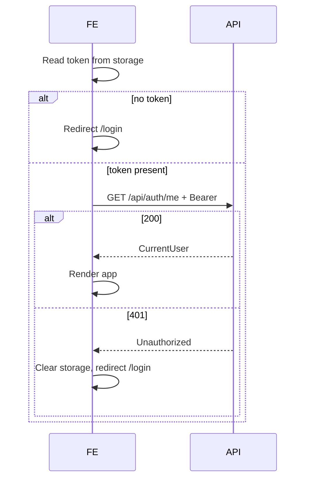

# Auth login — frontend integration (AI agent handover)

**Status:** Implemented in Next.js (JWT Bearer on API clients, `/login`, session guard, user menu + change password).  
**Backend contract:** [`AUTH_LOGIN_BACKEND_HANDOFF.md`](./AUTH_LOGIN_BACKEND_HANDOFF.md)  
**Audience:** AI agent (or developer) working on the **Next.js** frontend repository.

---

## 1. Why this work is required

The API uses a **global authorization fallback**: every controller action under `/api/**` requires an authenticated user unless explicitly anonymous.

| Without Bearer token | Result |
|----------------------|--------|
| `GET /api/employers`, candidates, projects, dashboard, admin, etc. | **401 Unauthorized** |
| `POST /api/auth/login` | **200** (anonymous) |
| `GET /api/health` | **200** (anonymous) |

**Until the FE sends `Authorization: Bearer <accessToken>` on API calls, the existing app will fail after the protected API is deployed.**

There is **no refresh token** in v1. One JWT lasts **7 days** (`expiresAt` on login response). After password change, **old tokens remain valid until expiry** (no server-side revocation).

---

## 2. Environment & CORS

| Item | Value |
|------|--------|
| API base (local) | `http://localhost:5103` (per existing FE docs) |
| Env var | Use the same pattern as other API clients: `NEXT_PUBLIC_API_URL` and/or `API_BASE_URL` |
| JSON | **camelCase** property names on request/response bodies |
| `Content-Type` | `application/json` for auth POST bodies |

**CORS (API already configured):** allowed origins include `http://localhost:3000`, `https://main.dnqtv881k8qvg.amplifyapp.com`, `https://rabzhitlist.dplit.com`. Auth uses the **`Authorization` header** (not cookies). `AllowCredentials()` is enabled on the API but is **not required** for Bearer JWT.

**FE agent:** Confirm the actual base URL helper in the FE repo (e.g. `src/lib/services/*-api.ts`) and **extend that layer** so all existing `fetch` calls attach the token.

---

## 3. Auth API reference

Base path: `{API_BASE_URL}/api/auth`

### 3.1 `POST /api/auth/login` — **no auth**

**Request body**

```json
{
  "email": "user@dplit.com",
  "password": "plaintext-password"
}
```

- Login identifier is **email only** (no username).
- Email is trimmed server-side; citext makes matching case-insensitive.

**Success `200`**

```json
{
  "accessToken": "eyJhbGciOiJIUzI1NiIs...",
  "expiresAt": "2026-09-28T12:00:00.000Z",
  "user": {
    "id": 1,
    "fullName": "Rabiah Zareen",
    "email": "rabiah.z@dplit.com"
  }
}
```

| Field | Type | Notes |
|-------|------|--------|
| `accessToken` | string | Send as `Authorization: Bearer {accessToken}` |
| `expiresAt` | string (ISO 8601, UTC) | Aligns with JWT `exp`; use for client-side session expiry UX |
| `user.id` | number | `long` on server |
| `user.fullName` | string | Display name |
| `user.email` | string | |

**Errors**

| Status | Body | When |
|--------|------|------|
| **401** | JSON string: `"Email or password is incorrect."` | Unknown email, soft-deleted user, wrong password (same message for all) |
| **400** | JSON string | e.g. `"Email is required."`, `"Password is required."` |

ASP.NET returns these messages as a **JSON-encoded string** (quoted), not `{ "message": "..." }`. Parse accordingly (e.g. `response.json()` may yield a string).

---

### 3.2 `GET /api/auth/me` — **Bearer required**

**Headers:** `Authorization: Bearer {accessToken}`

**Success `200`**

```json
{
  "id": 1,
  "fullName": "Rabiah Zareen",
  "email": "rabiah.z@dplit.com",
  "createdAt": "2026-01-15T08:00:00.000Z"
}
```

**Errors**

| Status | When |
|--------|------|
| **401** | Missing/invalid/expired token, or user soft-deleted after token was issued |

Use on **app bootstrap** to restore session when a stored token exists.

---

### 3.3 `POST /api/auth/logout` — **Bearer required**

**Headers:** `Authorization: Bearer {accessToken}`  
**Body:** none  

**Success `204`** No Content.

Server does **not** invalidate the JWT in v1. The client **must** delete the stored token (and user snapshot) after a successful logout call (or skip the call and only clear client state if offline — product choice).

---

### 3.4 `POST /api/auth/change-password` — **Bearer required**

**Request body**

```json
{
  "currentPassword": "old",
  "newPassword": "newpassword"
}
```

| Rule | Detail |
|------|--------|
| `newPassword` min length | **8** characters (server-enforced) |

**Success `200`**

```json
{
  "message": "Success"
}
```

**Errors**

| Status | Body (examples) |
|--------|------------------|
| **401** | `"Current password is incorrect."` |
| **400** | `"New password must be at least 8 characters."`, `"Current password is required."`, etc. |

**Note:** After success, the **current access token still works** until `expiresAt`. Optional UX: show “password updated” and keep session, or prompt re-login.

---

### 3.5 `GET /api/health` — **no auth** (optional FE use)

**Success `200`**

```json
{
  "status": "healthy"
}
```

Useful for connectivity checks; not required for login flow.

---

## 4. TypeScript types (suggested)

```typescript
export type AuthUser = {
  id: number
  fullName: string
  email: string
}

export type LoginResponse = {
  accessToken: string
  expiresAt: string
  user: AuthUser
}

export type CurrentUser = AuthUser & {
  createdAt: string
}

export type LoginRequest = {
  email: string
  password: string
}

export type ChangePasswordRequest = {
  currentPassword: string
  newPassword: string
}

export type ChangePasswordResponse = {
  message: string
}
```

---

## 5. Recommended FE architecture

### 5.1 Central API client (critical)

**Do not** add Bearer headers only on login. **Every** existing service that calls `/api/**` must send the token.

Pattern used elsewhere in this product (from employer integration docs):

- Module such as `src/lib/services/employers-api.ts` uses `fetch(`${API_BASE_URL}/api/employers?...`)`.

**Required change:**

1. Introduce shared helper, e.g. `src/lib/api-client.ts` or extend existing `fetch` wrapper:
   - Read token from auth storage.
   - Set `headers: { Authorization: \`Bearer ${token}\`, ... }` when token present.
   - Set `Content-Type: application/json` for JSON bodies.
2. Refactor **all** API service modules to use that helper (candidates, employers, projects, dashboard, admin, uploads, etc.).

**Login and health** calls must **not** send a stale Bearer token on `POST /api/auth/login` (either omit `Authorization` for that URL or use a dedicated unauthenticated fetch).

### 5.2 Auth service module (suggested)

`src/lib/services/auth-api.ts` (names illustrative — match FE conventions):

| Function | Endpoint |
|----------|----------|
| `login(email, password)` | `POST /api/auth/login` |
| `logout()` | `POST /api/auth/logout` |
| `getCurrentUser()` | `GET /api/auth/me` |
| `changePassword(current, new)` | `POST /api/auth/change-password` |

### 5.3 Token & session storage

Backend does **not** mandate storage. Choose one approach and apply consistently:

| Approach | Pros | Cons |
|----------|------|------|
| `sessionStorage` | Cleared on tab close | New tab needs login |
| `localStorage` | Survives refresh | XSS exposure if app has XSS |
| Memory only | Smallest exposure | Lost on refresh |

Also persist optional **`expiresAt`** and/or **`user`** snapshot for UI (header display name).

**FE agent:** If the repo already has a session/auth pattern, follow it; otherwise implement `localStorage` + `GET /api/auth/me` on load is a common default for internal admin apps.

### 5.4 Route protection (Next.js)

Implement **login page** (e.g. `/login`) and guard **app routes**:

- **If no token** (or expired `expiresAt`): redirect to `/login`.
- **If token exists**: call `GET /api/auth/me`; on **401** clear storage and redirect to `/login`.
- **After login success**: store token + user, redirect to previous page or home.

Use the same mechanism the app already uses for protected layouts (App Router `middleware.ts`, layout guards, or Pages `getServerSideProps` — **inspect the FE repo**; not specified in backend docs).

### 5.5 Global **401** handling

When any API returns **401**:

1. Clear auth storage.
2. Redirect to login (avoid infinite loop on login page).
3. Optionally show toast: “Session expired” or server message if body is a string.

Do **not** treat login **401** (`Email or password is incorrect.`) as session expiry — show inline form error.

### 5.6 UI surfaces (minimum viable)

| Surface | Behavior |
|---------|----------|
| **Login** | Email + password form → `login()` → redirect |
| **Logout** | Call `logout()` (best effort) + clear client + redirect `/login` |
| **User menu** | Show `user.fullName` or `user.email` from session / `me` |
| **Change password** | Form: current + new (validate min 8 client-side) → `changePassword()` → success message |

No roles in v1 — any logged-in user can use the full app.

---

## 6. End-to-end flows

### 6.1 Cold start (returning user)



### 6.2 Login

1. `POST /api/auth/login` (no Bearer).
2. On 200: save `accessToken`, `expiresAt`, `user`.
3. Navigate to app home (or `callbackUrl` query param if you add one).

### 6.3 Authenticated data fetch

1. `GET /api/employers?...` with `Authorization: Bearer ...`.
2. Same for all other modules.

### 6.4 Logout

1. `POST /api/auth/logout` with Bearer (optional if network fails).
2. Clear storage; redirect `/login`.

---

## 7. Integration checklist (for AI agent)

- [x] Add `auth-api.ts` (or equivalent) with four auth methods.
- [x] Add shared `fetchWithAuth` (`src/lib/api-client.ts`) used by **all** `/api/**` clients.
- [x] Ensure `POST /api/auth/login` does not send invalid Bearer.
- [x] Add `/login` page and auth layout / dashboard guard.
- [x] On app init: token + `GET /api/auth/me` validation.
- [x] Global 401 → clear session + redirect (except login form errors).
- [x] Logout control in shell/header.
- [x] Change-password UI (user menu) wired to `POST /api/auth/change-password`.
- [ ] Manual smoke: login → employers list → logout → employers 401.
- [ ] Deploy FE **with** protected API (or accept downtime until FE ships).

---

## 8. Smoke tests (manual / E2E)

**Prerequisites:** API running locally; DB migrated and seeded; valid user email/password.

1. **Health:** `GET /api/health` without auth → `{ "status": "healthy" }`.
2. **Login failure:** wrong password → 401, body `"Email or password is incorrect."`
3. **Login success:** valid credentials → `accessToken`, `user.fullName`.
4. **Me:** `GET /api/auth/me` with Bearer → 200.
5. **Protected:** `GET /api/employers?pageNumber=1&pageSize=5` without Bearer → 401.
6. **Protected:** same with Bearer → 200.
7. **Logout:** `POST /api/auth/logout` → 204; client clears token; employers → 401.
8. **Change password:** new password min 7 chars → 400; wrong current → 401; success → 200 `{ "message": "Success" }`; login with new password works.

**Seeded emails (local/dev)** — passwords are **not** in repo; use credentials from your team:

| fullName | email |
|----------|--------|
| Rabiah Zareen | rabiah.z@dplit.com |
| Muhammad Reyyan | reyyan.m@dplit.com |
| Muhammad Ahmed | ahmed.m@dplit.com |

---

## 9. Deploy coordination

| Order | Action |
|-------|--------|
| 1 | Ship FE with login + Bearer on all API calls |
| 2 | Deploy API with auth enabled (or deploy both in same window) |
| 3 | Prod: ensure `users` table + seeds exist on prod DB (`dotnet ef database update`) |
| 4 | Prod smoke: login on `https://rabzhitlist.dplit.com` (or Amplify URL) against prod API |

**FE agent:** Confirm prod `NEXT_PUBLIC_API_URL` points at the EC2 (or gateway) API host used today.

---

## 10. Out of scope (v1)

- Refresh tokens / `POST /api/auth/refresh`
- Roles / permissions (flat users)
- “Remember me” beyond token lifetime
- Server-side token blocklist on logout
- OAuth / SSO
- Rate limiting / account lockout on login UI (API deferred too)

---

## 11. Open questions (resolve in FE repo — do not guess)

Answer these by **reading the Next.js codebase** before large refactors:

1. **Router:** App Router vs Pages Router — where should `/login` and middleware live?
2. **Existing API helper:** Is there already a shared `fetch` wrapper to extend (preferred) vs many raw `fetch` calls?
3. **Token storage:** `localStorage` vs `sessionStorage` vs httpOnly cookie (cookie **not** used by this API)?
4. **Post-login redirect:** Default landing route (`/`, `/employers`, `/dashboard`)?
5. **Prod API URL:** Exact value of `NEXT_PUBLIC_API_URL` for Amplify vs `dplit.com`?

If any of the above are unclear from the repo, ask the product owner before shipping.

---

## 12. Backend file reference (read-only)

| Area | Path |
|------|------|
| Controller | `MyApp.API/Controllers/AuthController.cs` |
| Service | `MyApp.Application/Services/AuthService.cs` |
| Auth wiring | `MyApp.API/Program.cs` (`FallbackPolicy`, JWT, CORS) |
