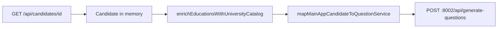

# `candidate_data` sent to the Question Service (port 8002)

What the Next.js frontend posts as `candidate_data` on `POST /api/generate-questions` to the Python LLM service (`NEXT_PUBLIC_QUESTIONS_API_URL`, default `http://localhost:8002`).

**Related docs:** [FRONTEND_INTEGRATION_CONTRACT.md](./FRONTEND_INTEGRATION_CONTRACT.md) § 2.1 · [CANDIDATE_DATA_MAPPING.md](./CANDIDATE_DATA_MAPPING.md) (how the Python service reads each field for missing-field detection)

---

## Request envelope

The browser sends:

```json
{
  "candidate_id": "<candidate.id from main app>",
  "candidate_data": { /* see below */ },
  "conversation_context": "cold_call"
}
```

| Field | Source |
|---|---|
| `candidate_id` | `candidate.id` — not repeated inside `candidate_data` |
| `candidate_data` | `mapMainAppCandidateToQuestionService(candidate)` after optional education enrichment |
| `conversation_context` | `"cold_call"` from Cold Caller dialog; otherwise the active mode string |

`missing_fields` is **not** sent; the Python service computes gaps from `candidate_data`.

**Always-ask on cold call:** `currentSalary`, `expectedSalary`, `linkedinUrl` — question generated every time; enrichment when populated (§ 4.14).

---

## Pipeline (frontend)



| Step | File | Role |
|---|---|---|
| 1 | `src/lib/services/candidates-api.ts` | Loads main-app `Candidate` from ASP.NET API |
| 2 | `src/lib/services/questions-api.ts` → `generateQuestions()` | Orchestrates the POST |
| 3 | `src/lib/utils/map-education-for-service.ts` → `enrichEducationsWithUniversityCatalog()` | For each education row with `universityId`, fetches `GET /api/universities/{id}` and merges catalog + campuses **before** mapping |
| 3b | `src/lib/utils/map-work-experience-for-service.ts` → `enrichWorkExperiencesWithEmployerCatalog()` *(planned)* | For each work experience row with `employerId`, fetches `GET /api/employers/{id}` and merges employer catalog + `locations[]` + `layoffs[]` **before** mapping |
| 4 | `src/lib/utils/map-candidate-for-question-service.ts` → `mapMainAppCandidateToQuestionService()` | Produces the `candidate_data` object |
| 5 | Sub-mappers | `map-education-for-service.ts`, `map-certification-for-service.ts`, `map-linked-project-for-service.ts` |

Type definition: `src/types/question-generation.ts` → `CandidateDataForQuestionService`.

---

## Mapping conventions

| Rule | Behavior |
|---|---|
| Empty strings | Trimmed; `""` → `null` (`emptyToNull`) |
| Dates | `Date` → ISO-8601 string (`toISOString()`); missing → `null` |
| Arrays | Missing → `[]` (never omitted for `techStacks`, nested `workExperiences[].projects`, etc.) |
| `resume` | `hasResume === true` → `"attached"`; otherwise `null` (not a file URL) |
| Achievements | Uses `candidate.achievements` when present; falls back to legacy `candidate.competitions` with `achievementType: "competition"` |
| Education ranking | UI/API labels normalized to service values: `tier_1`, `tier_2`, `tier_3`, `dpl_favourite` |
| Certification `issuingBody` | `cert.issuingBody` ?? `cert.certificationIssuerName` |

---

## Top-level `candidate_data` shape

Type: `CandidateDataForQuestionService`

| Property | Type | Main-app source |
|---|---|---|
| `name` | `string \| null` | `candidate.name` |
| `postingTitle` | `string \| null` | `candidate.postingTitle` |
| `email` | `string \| null` | `candidate.email` |
| `mobileNo` | `string \| null` | `candidate.mobileNo` |
| `cnic` | `string \| null` | `candidate.cnic` |
| `city` | `string \| null` | `candidate.city` |
| `githubUrl` | `string \| null` | `candidate.githubUrl` |
| `linkedinUrl` | `string \| null` | `candidate.linkedinUrl` |
| `resume` | `"attached" \| null` | `candidate.hasResume` |
| `currentSalary` | `number \| null` | `candidate.currentSalary` |
| `expectedSalary` | `number \| null` | `candidate.expectedSalary` |
| `source` | `string \| null` | `candidate.source` |
| `personalityType` | `string \| null` | `candidate.personalityType` (e.g. `ESTJ`) |
| `techStacks` | `string[]` | Standalone tech stacks (`candidate.techStacks`) |
| `workExperiences` | `WorkExperienceForService[]` | `candidate.workExperiences` (includes nested `projects[]`) |
| `educations` | `EducationForService[]` | `candidate.educations` (after university catalog enrichment) |
| `certifications` | `CertificationForService[]` | `candidate.certifications` |
| `achievements` | `AchievementForService[]` | `candidate.achievements` or legacy `competitions` |

> **Removed:** top-level `projects`. If a legacy client still sends `candidate_data.projects`, the QG service **ignores** it (silent). All projects are under `workExperiences[].projects`.

### Not included in `candidate_data`

These exist on the main-app `Candidate` but are **stripped** by the mapper:

- `id`, `status`, `createdAt`, `updatedAt`
- `latestJobTitle`, `totalExperienceYears`, `totalExperienceMonths`, `dataProgressPercentage`
- Resume metadata (`resumeFileName`, `resumeContentType`, …)
- `organizationalRoles`
- List-only match DTOs (`matchedProjects`, `matchedEmployers`, …)
- Row/catalog IDs: `employerId`, `universityId`, `certificationId`, `projectId`, education/cert/project `id`

---

## Nested shapes

### `workExperiences[]` → `WorkExperienceForService`

**Pre-step (planned):** `enrichWorkExperiencesWithEmployerCatalog()` merges employer catalog from `GET /api/employers/{employerId}` when the row has a linked id. GET candidate returns flat link fields only; employer catalog is not on the ASP.NET work-experience DTO.

#### Link fields (visible in UI; enrichment when populated — § 4.13.2a)

| Property | Type | Notes |
|---|---|---|
| `employerName` | `string \| null` | |
| `jobTitle` | `string \| null` | |
| `startDate` | ISO string \| null | |
| `endDate` | ISO string \| null | `null` allowed on current role only |
| `techStacks` | `string[]` | Enrichment when populated (§ 4.9) |
| `shiftType` | `string \| null` | `day`, `night`, `evening`, `rotational`, `flexible`, `on_call` |
| `workMode` | `string \| null` | `onsite`, `remote`, `hybrid` |
| `timeSupportZones` | `string[]` | |
| `benefits` | `BenefitForService[]` | Same property for role link and employer catalog — if populated, catalog `benefits` question is skipped |
| `projects` | `WorkExperienceProjectForService[]` | Nested projects (§ 4.10) |

**`benefits[]`**

| Property | Type | Notes |
|---|---|---|
| `name` | `string` | Benefit name |
| `amount` | `number \| null` | `null` when no amount |
| `unit` | `string \| null` | `null` when no unit |

#### Employer catalog (accordion; missing-only; flat on row after enrichment)

| Property | Type | Notes |
|---|---|---|
| `foundedYear` | `number \| null` | |
| `status` | `string \| null` | `open`, `closed`, `flagged` |
| `types` | `string[]` | `services_based`, `product_based`, `saas`, `startup`, `integrator`, `resource_augmentation` |
| `ranking` | `string \| null` | `tier_1`, `tier_2`, `tier_3`, `dpl_favourite` |
| `minEmployees` | `number \| null` | |
| `maxEmployees` | `number \| null` | |
| `websiteUrl` | `string \| null` | |
| `linkedInUrl` | `string \| null` | Matches ASP.NET JSON casing |
| `isDplCompetitor` | `boolean \| null` | `false` is **present** |
| `salaryPolicy` | `string \| null` | `gross_salary`, `remittance_salary`, `net_salary`, `fixed_salary_plus_commission_or_monthly_bonus` |
| `tags` | `string[]` | Employer tags (names only) |

**Shared properties** (`workMode`, `shiftType`, `timeSupportZones`, `benefits`): single field on the row — if populated for the role, the question service does **not** emit a separate catalog key.

#### Office locations — `locations[]`

Mapper flattens `EmployerLocationDto.country` to a **string** (country name) before POST.

| Property | Type |
|---|---|
| `country` | `string \| null` |
| `city` | `string \| null` |
| `address` | `string \| null` |
| `isHeadquarters` | `boolean \| null` |

apiFieldName pattern: `work_experience_{i}_office_{j}_country`, `_city`, `_address`, `_isHeadquarters`. Synthetic `office_0_*` when `locations[]` is empty.

#### Layoffs — `layoffs[]`

| Property | Type | Notes |
|---|---|---|
| `layoffDate` | ISO date string \| null | |
| `affectedEmployees` | `number \| null` | |
| `reason` | `string \| null` | `cost_reduction`, `restructuring`, `economic_downturn`, `funding_issues`, `other` |
| `source` | `string \| null` | |

apiFieldName pattern: `work_experience_{i}_layoff_{j}_*`. Synthetic `layoff_0_*` when `layoffs[]` is empty.

### `workExperiences[].projects[]` → `LinkedProjectForService`

Mapped by `mapLinkedProjectToServicePayload` (nested under work experience only).

> **Removed:** top-level `candidate_data.projects`. Legacy top-level arrays are ignored if present.

| Property | Type |
|---|---|
| `projectName` | `string \| null` |
| `contributionNotes` | `string \| null` |
| `employerName` | `string \| null` |
| `projectType` | `string \| null` | e.g. `Employer`, `Academic`, `Personal`, `Freelance`, `Open Source` |
| `status` | `string \| null` | `Development`, `Maintenance`, `Closed` |
| `teamSize` | `string \| null` | Formatted from `teamSize` or `minTeamSize`–`maxTeamSize` |
| `minTeamSize` | `number \| null` |
| `maxTeamSize` | `number \| null` |
| `techStacks` | `string[]` |
| `technicalAspects` | `string[]` |
| `horizontalDomains` | `string[]` |
| `verticalDomains` | `string[]` |
| `description` | `string \| null` |
| `notes` | `string \| null` |
| `startDate` | ISO string \| null |
| `endDate` | ISO string \| null |
| `link` | `string \| null` | API field suffix is `projectLink` |
| `isPublished` | `boolean \| null` |
| `publishPlatforms` | `string[]` |
| `downloadCount` | `number \| null` |

### `educations[]` → `EducationForService`

**Pre-step:** `enrichEducationsWithUniversityCatalog()` merges university catalog from `GET /api/universities/{universityId}` when the education row has a linked id. GET candidate returns flat link fields only; catalog is not on the ASP.NET response.

| Property | Type | Notes |
|---|---|---|
| `universityName` | `string \| null` | Also sets `universityLocationName` to the same value (legacy alias) |
| `universityLocationName` | `string \| null` | Legacy; server treats as `universityName` |
| `degreeName` | `string \| null` | |
| `majorName` | `string \| null` | |
| `startMonth` | ISO string \| null | |
| `endMonth` | ISO string \| null | |
| `grades` | `string \| null` | |
| `isTopper` | `boolean \| null` | |
| `isCheetah` | `boolean \| null` | From API `isMainCheetah` on ingest |
| `country` | `string \| null` | From university catalog enrichment |
| `ranking` | `string \| null` | `tier_1`, `tier_2`, `tier_3`, `dpl_favourite` |
| `websiteUrl` | `string \| null` | University catalog |
| `linkedinUrl` | `string \| null` | University catalog |
| `locations` | `EducationLocationForService[]` | Campuses |

**`locations[]`**

| Property | Type |
|---|---|
| `city` | `string \| null` |
| `address` | `string \| null` |
| `isMainCampus` | `boolean \| null` |

### `certifications[]` → `CertificationForService`

Catalog fields (`issuingBody`, `issuingBodyUrl`, `certificationName`) are merged on **GET candidate** ingest via `parseCertificationCatalogFromApi` when the API returns nested certification/issuer graphs. No separate fetch before POST (unlike education).

| Property | Type |
|---|---|
| `certificationName` | `string \| null` |
| `certificationLevel` | `string \| null` | `foundation`, `associate`, `professional`, `expert`, `master` |
| `issueDate` | ISO string \| null |
| `expiryDate` | ISO string \| null |
| `certificationUrl` | `string \| null` |
| `issuingBody` | `string \| null` |
| `issuingBodyUrl` | `string \| null` |

### `achievements[]` → `AchievementForService`

| Property | Type |
|---|---|
| `name` | `string \| null` |
| `achievementType` | `string \| null` | `competition`, `openSource`, `award`, `medal`, `publication`, `certification`, `recognition`, `other` |
| `ranking` | `string \| null` | Free text |
| `year` | `number \| null` |
| `url` | `string \| null` |
| `description` | `string \| null` |

---

## Example payload

Illustrative `candidate_data` after mapping (abbreviated nested arrays):

```json
{
  "name": "Jane Doe",
  "postingTitle": "Senior Engineer",
  "email": "jane@example.com",
  "mobileNo": "+923001234567",
  "cnic": null,
  "city": "Lahore",
  "githubUrl": "https://github.com/janedoe",
  "linkedinUrl": null,
  "resume": "attached",
  "currentSalary": 250000,
  "expectedSalary": 350000,
  "source": "linkedin",
  "personalityType": "INTJ",
  "techStacks": ["TypeScript", "React"],
  "workExperiences": [
    {
      "employerName": "Acme Corp",
      "jobTitle": "Software Engineer",
      "startDate": "2020-03-01T00:00:00.000Z",
      "endDate": null,
      "techStacks": ["C#", ".NET"],
      "shiftType": "day",
      "workMode": "hybrid",
      "timeSupportZones": ["EST"],
      "benefits": [{ "name": "Health Insurance", "amount": null, "unit": null }],
      "projects": [
        {
          "projectName": "Side CLI",
          "contributionNotes": "Built the parser",
          "employerName": null,
          "projectType": "Personal",
          "status": "Development",
          "teamSize": "1",
          "minTeamSize": 1,
          "maxTeamSize": 1,
          "techStacks": ["Go"],
          "technicalAspects": [],
          "horizontalDomains": [],
          "verticalDomains": [],
          "description": null,
          "notes": null,
          "startDate": "2024-01-01T00:00:00.000Z",
          "endDate": null,
          "link": null,
          "isPublished": false,
          "publishPlatforms": [],
          "downloadCount": null
        }
      ]
    }
  ],
  "educations": [
    {
      "universityName": "MIT",
      "universityLocationName": "MIT",
      "degreeName": "Bachelor's",
      "majorName": "Computer Science",
      "startMonth": "2016-09-01T00:00:00.000Z",
      "endMonth": "2020-06-01T00:00:00.000Z",
      "grades": "3.8 GPA",
      "isTopper": false,
      "isCheetah": false,
      "country": "United States",
      "ranking": "tier_1",
      "websiteUrl": "https://mit.edu",
      "linkedinUrl": null,
      "locations": [
        { "city": "Cambridge", "address": null, "isMainCampus": true }
      ]
    }
  ],
  "certifications": [
    {
      "certificationName": "AWS Solutions Architect",
      "certificationLevel": "professional",
      "issueDate": "2023-06-01T00:00:00.000Z",
      "expiryDate": null,
      "certificationUrl": null,
      "issuingBody": "Amazon Web Services",
      "issuingBodyUrl": "https://aws.amazon.com"
    }
  ],
  "achievements": [
    {
      "name": "Kaggle Expert",
      "achievementType": "competition",
      "ranking": "Top 1%",
      "year": 2022,
      "url": null,
      "description": null
    }
  ]
}
```

---

## Where to look in code

| Question | Location |
|---|---|
| HTTP POST | `src/lib/services/questions-api.ts` |
| Root mapper | `src/lib/utils/map-candidate-for-question-service.ts` |
| Education + university fetch | `src/lib/utils/map-education-for-service.ts` |
| Certifications | `src/lib/utils/map-certification-for-service.ts` |
| Projects (nested under work experience) | `src/lib/utils/map-linked-project-for-service.ts` |
| TypeScript types | `src/types/question-generation.ts` |
| Main-app → in-memory candidate | `src/lib/services/candidates-api.ts` (`mapCandidate`, `mapEducation`, `mapCertification`, …) |
| Cold Caller entry | `src/components/cold-caller/cold-caller-dialog.tsx` → `generateQuestions()` |
