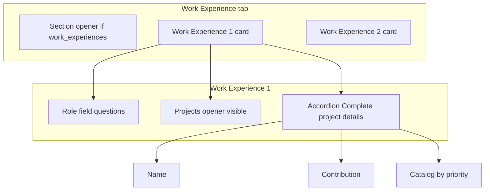
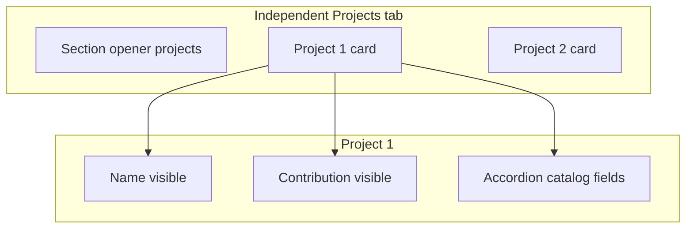

# Frontend Integration Contract — Generate Questions API

This document is the **source of truth** for AI agents and engineers integrating the **Next.js frontend** (`http://localhost:3000`) with the **Python LLM Question Generation Service** (`http://localhost:8002`).

**Local testing pattern (confirmed):** direct browser `fetch` from Next.js → Python API. No Next.js route-handler proxy required for local dev.

**Candidate data (confirmed):** the production Next.js app uses a **different shape** than this repo’s `sample_candidates.py`. The frontend **must map** main-app candidate objects to the Python service shape **before** calling the API. See [CANDIDATE_DATA_MAPPING.md](./CANDIDATE_DATA_MAPPING.md) for payload mapping and **apiFieldName** keys returned in `field` / `missing_fields`.

---

## 1. Services & URLs (local)

| Service | URL | Purpose |
|---|---|---|
| Next.js frontend | `http://localhost:3000` | Production UI under development |
| Python LLM API | `http://localhost:8002` | Question generation |
| API health | `GET http://localhost:8002/health` | Liveness check |
| OpenAPI docs | `GET http://localhost:8002/docs` | Interactive Swagger UI |
| Demo HTML (optional) | `http://localhost:8000/candidates_table.html` | Legacy prototype in this repo |

### Start the Python API locally

From the repo root:

```bash
pip install -r requirements.txt
# Create config.yaml from config.example.yaml and set OPENAI_API_KEY
python question_generator.py
# OR run API + demo static server together:
python run_servers.py
```

### Frontend environment variable

In the Next.js app (`.env.local`):

```bash
NEXT_PUBLIC_QUESTIONS_API_URL=http://localhost:8002
```

Reference: [.env.frontend.example](../.env.frontend.example)

---

## 2. API endpoints

### 2.1 `POST /api/generate-questions`

Generates cold-call questions for **missing** candidate fields, grouped into **7 sections**.

**Request headers**

```
Content-Type: application/json
```

**Request body**

| Field | Type | Required | Notes |
|---|---|---|---|
| `candidate_id` | `string` | Yes | Stable candidate identifier from your app |
| `candidate_data` | `object` | Yes | Full candidate profile in **Python service shape** (after mapping) |
| `conversation_context` | `string` | No | Default: `"cold_call"` |
| `missing_fields` | `string[]` | No | **Ignored by the server.** Missing fields are computed server-side. Do not rely on sending this. |

**Example request**

```json
{
  "candidate_id": "550e8400-e29b-41d4-a716-446655440000",
  "candidate_data": {
    "name": "Umais Rasheed",
    "email": null,
    "mobileNo": null,
    "workExperiences": [],
    "techStacks": ["TypeScript"],
    "projects": [],
    "educations": [],
    "certifications": [],
    "achievements": []
  },
  "conversation_context": "cold_call"
}
```

**Success response `200`**

| Field | Type | Description |
|---|---|---|
| `sections` | `SectionResult[]` | Always **7 entries**, one per section (see below) |
| `generated_at` | `string` (ISO datetime) | Server timestamp |
| `candidate_id` | `string` | Echo of request `candidate_id` |
| `total_questions` | `number` | Sum of questions across all sections |

**`SectionResult`**

| Field | Type | Description |
|---|---|---|
| `section` | `QuestionSectionId` | Machine id (snake_case) |
| `label` | `string` | Human label for UI tabs |
| `missing_fields` | `string[]` | Missing field keys for this section, **sorted by priority (high → low)** |
| `questions` | `GeneratedQuestion[]` | LLM questions, **sorted by priority (high → low)** |

**`GeneratedQuestion`**

| Field | Type | Description |
|---|---|---|
| `question` | `string` | Question text for the cold caller |
| `field` | `string` | Field key this question targets (`apiFieldName`) |
| `section` | `QuestionSectionId` | Section id |
| `priority` | `number` | **Server-assigned** weight (higher = ask first within tab). Not LLM-authored. |
| `context` | `string` | Interviewer guidance from LLM or server |
| `prompt_type` | `'missing' \| 'enrichment'` | **`missing`** = gap-fill (field empty). **`enrichment`** = follow-up when data already exists (see § 4.9). Default `missing`. |
| `existing_values` | `string[] \| null` | For `prompt_type: 'enrichment'` tech-stack questions — values already on file from parsed resume. Optional display in UI. |

**`QuestionSectionId` (fixed order)**

1. `basic_information`
2. `work_experience`
3. `independent_tech_stacks`
4. `independent_projects`
5. `education`
6. `certifications`
7. `achievements`

**Example response (abbreviated)**

```json
{
  "sections": [
    {
      "section": "basic_information",
      "label": "Basic Information",
      "missing_fields": ["currentSalary", "email", "mobileNo"],
      "questions": [
        {
          "question": "Could you share your current compensation?",
          "field": "currentSalary",
          "section": "basic_information",
          "priority": 1,
          "context": "Ask naturally after rapport."
        }
      ]
    }
  ],
  "generated_at": "2026-06-18T12:00:00",
  "candidate_id": "550e8400-e29b-41d4-a716-446655440000",
  "total_questions": 12
}
```

**Error responses**

| Status | When |
|---|---|
| `422` | Invalid JSON / Pydantic validation failure |
| `500` | OpenAI error, config error, or unhandled server error (`detail` string in body) |

### 2.2 `GET /health`

```json
{
  "status": "healthy",
  "model": "gpt-4.1"
}
```

Use before showing “Generate Questions” or on app load to verify the Python service is up.

---

## 3. TypeScript types (frontend)

Copy into the Next.js codebase (e.g. `types/question-generation.ts`):

```typescript
export type QuestionSectionId =
  | 'basic_information'
  | 'work_experience'
  | 'independent_tech_stacks'
  | 'independent_projects'
  | 'education'
  | 'certifications'
  | 'achievements';

export interface GenerateQuestionsRequest {
  candidate_id: string;
  candidate_data: CandidateDataForQuestionService;
  conversation_context?: 'cold_call' | string;
}

export type PromptType = 'missing' | 'enrichment';

export interface GeneratedQuestion {
  question: string;
  field: string;
  section: QuestionSectionId;
  priority: number;
  context: string;
  prompt_type?: PromptType;
  existing_values?: string[] | null;
}

export interface SectionQuestionResult {
  section: QuestionSectionId;
  label: string;
  missing_fields: string[];
  questions: GeneratedQuestion[];
}

export interface GenerateQuestionsResponse {
  sections: SectionQuestionResult[];
  generated_at: string;
  candidate_id: string;
  total_questions: number;
}

// See CANDIDATE_DATA_MAPPING.md — map from your main app type to this shape.
export interface CandidateDataForQuestionService {
  name?: string | null;
  postingTitle?: string | null;
  email?: string | null;
  mobileNo?: string | null;
  cnic?: string | null;
  city?: string | null;
  githubUrl?: string | null;
  linkedinUrl?: string | null;
  resume?: string | null;
  currentSalary?: number | null;
  expectedSalary?: number | null;
  source?: string | null;
  personalityType?: string | null;
  isTopDeveloper?: boolean | null;
  techStacks?: string[];
  projects?: StandaloneProject[];
  workExperiences?: WorkExperience[];
  educations?: Education[];
  certifications?: Certification[];
  achievements?: Achievement[];
}

export interface WorkExperience {
  employerName?: string | null;
  jobTitle?: string | null;
  startDate?: string | null;
  endDate?: string | null;
  techStacks?: string[];
  shiftType?: string | null;
  workMode?: string | null;
  timeSupportZones?: string[];
  benefits?: Benefit[];
  projects?: WorkExperienceProject[];
}

export interface WorkExperienceProject {
  projectName?: string | null;
  contributionNotes?: string | null;
  employerName?: string | null;
  clientLocations?: string[];
  projectType?: string | null;
  status?: string | null;
  minTeamSize?: number | null;
  maxTeamSize?: number | null;
  techStacks?: string[];
  technicalAspects?: string[];
  technicalDomains?: string[];
  horizontalDomains?: string[];
  verticalDomains?: string[];
  description?: string | null;
  notes?: string | null;
  startDate?: string | null;
  endDate?: string | null;
  link?: string | null;
  isPublished?: boolean | null;
  publishPlatforms?: string[];
  downloadCount?: number | null;
}

export interface StandaloneProject {
  projectName?: string | null;
  contributionNotes?: string | null;
  employerName?: string | null;
  clientLocations?: string[];
  projectType?: string | null;
  status?: string | null;
  minTeamSize?: number | null;
  maxTeamSize?: number | null;
  techStacks?: string[];
  technicalAspects?: string[];
  technicalDomains?: string[];
  horizontalDomains?: string[];
  verticalDomains?: string[];
  description?: string | null;
  notes?: string | null;
  startDate?: string | null;
  endDate?: string | null;
  link?: string | null;
  isPublished?: boolean | null;
  publishPlatforms?: string[];
  downloadCount?: number | null;
}

export interface EducationLocation {
  city?: string | null;
  address?: string | null;
  isMainCampus?: boolean | null;
}

export interface Education {
  universityName?: string | null;
  degreeName?: string | null;
  majorName?: string | null;
  startMonth?: string | null;
  endMonth?: string | null;
  grades?: string | null;
  isTopper?: boolean | null;
  isCheetah?: boolean | null;
  country?: string | null;
  ranking?: string | null;
  websiteUrl?: string | null;
  linkedinUrl?: string | null;
  locations?: EducationLocation[];
}

export interface Certification {
  certificationName?: string | null;
  issueDate?: string | null;
  expiryDate?: string | null;
  certificationUrl?: string | null;
  certificationLevel?: string | null;
  issuingBody?: string | null;
  issuingBodyUrl?: string | null;
}

export type AchievementType =
  | 'competition'
  | 'openSource'
  | 'award'
  | 'medal'
  | 'publication'
  | 'certification'
  | 'recognition'
  | 'other';

export interface Achievement {
  name?: string | null;
  achievementType?: AchievementType | null;
  type?: number | null; // API DTO: 0–7 maps to achievementType if achievementType omitted
  ranking?: string | null;
  year?: number | null;
  url?: string | null;
  description?: string | null;
}

export interface Benefit {
  name?: string;
  amount?: number | null;
  unit?: string | null;
}
```

---

## 4. Client implementation rules

### 4.1 API client function

```typescript
const API_BASE = process.env.NEXT_PUBLIC_QUESTIONS_API_URL ?? 'http://localhost:8002';

export async function generateQuestions(
  candidateId: string,
  candidateData: CandidateDataForQuestionService,
): Promise<GenerateQuestionsResponse> {
  const response = await fetch(`${API_BASE}/api/generate-questions`, {
    method: 'POST',
    headers: { 'Content-Type': 'application/json' },
    body: JSON.stringify({
      candidate_id: candidateId,
      candidate_data: candidateData,
      conversation_context: 'cold_call',
    }),
  });

  if (!response.ok) {
    const errorBody = await response.text();
    throw new Error(`Generate questions failed (${response.status}): ${errorBody}`);
  }

  return response.json();
}
```

### 4.2 Mapping layer (required)

1. Load candidate from **main app API/state**.
2. Run `mapMainAppCandidateToQuestionService(candidate)` → `CandidateDataForQuestionService`.
3. POST mapped object as `candidate_data`.

Do **not** send the main-app shape directly unless it already matches `CandidateDataForQuestionService`. Fill in [CANDIDATE_DATA_MAPPING.md](./CANDIDATE_DATA_MAPPING.md).

### 4.3 UI — Generate Questions modal

Implement a **7-tab** modal matching section ids:

| Tab label | `section` id |
|---|---|
| Basic Information | `basic_information` |
| Work Experience | `work_experience` |
| Independent Tech Stacks | `independent_tech_stacks` |
| Independent Projects | `independent_projects` |
| Education | `education` |
| Certifications | `certifications` |
| Achievements | `achievements` |

**Per tab:**

- Show **“Section complete”** only when `missing_fields.length === 0` **and** `questions.length === 0`.
- If `missing_fields.length === 0` but `questions.length > 0` (e.g. tech-stack **enrichment** reminders — § 4.9), render the questions; do **not** show section complete.
- Tab badge (optional): `missing_fields.length` when > 0 — **never** count enrichment-only questions toward the badge.

**Default tabs** (`basic_information`, `independent_tech_stacks`, `education`, `certifications`, `achievements`):

- Optional compact missing-field summary (deduplicated human labels).
- Flat numbered questions list (already priority-sorted by API).
- Each question: **bold** question text, gray `context` line, small human **field label** (never raw `apiFieldName`).

**Work Experience tab** — follow **[§ 4.7 Work Experience tab rendering spec](#47-work-experience-tab-rendering-spec)** (grouped cards, not a flat list).

**Independent Projects tab** — follow **[§ 4.11 Independent Projects tab rendering spec](#411-independent-projects-tab-rendering-spec)** (grouped project cards, not a flat missing-fields list).

**Education tab** — follow **[§ 4.12 Education tab rendering spec](#412-education-tab-rendering-spec)** (link fields visible, university catalog + campuses in accordion; link enrichment § 4.12.2a).

**Tech stack enrichment** — Independent Tech Stacks + Work Experience role tech stacks may return `prompt_type: 'enrichment'` even when values exist. See **[§ 4.9](#49-tech-stack-enrichment-prompts)**.

**Basic information always-ask** — `currentSalary`, `expectedSalary`, `linkedinUrl` always return a question; **Reminder** when populated. See **[§ 4.14](#414-basic-information-always-ask-enrichment)**.

**Project enrichment** — Independent Projects openers + per-row Name/Contribution + Work Experience project openers/nested Name/Contribution. See **[§ 4.10](#410-project-enrichment-prompts-option-b)**.

**Header summary:**

- `total_questions`
- Sum of `missing_fields` across sections

**Loading state:** show spinner while `POST` is in flight (LLM call may take several seconds).

**Error state:** show message + retry button; display `error.message`.

**Empty profile:** if every section is complete, still show all 7 tabs with “Section complete”.

### 4.4 Display order

- Trust **`priority` from the API** for question order within each tab.
- Do **not** re-sort by LLM’s internal ordering; server overwrites priority from configured weights.
- Optional: secondary sort by `field` name when priorities tie.

### 4.5 Dates and serialization

- Send dates as **ISO 8601 strings** in JSON (e.g. `"2021-07-01T00:00:00.000Z"`).
- `null` = missing; `""` = missing; `[]` = missing for arrays.

### 4.6 CORS

Python service uses FastAPI `CORSMiddleware` with explicit origins (no `*` in Docker/production).

Default allowed origins:

- `http://localhost:3000`
- `http://127.0.0.1:3000`
- `http://localhost:8000` (demo `candidates_table.html` via `run_servers.py`)
- `http://127.0.0.1:8000`
- `https://main.dnqtv881k8qvg.amplifyapp.com`

Override with `ALLOWED_ORIGINS` (comma-separated) on the API container. Credentials are disabled. Browser calls from the Next.js app work without a Next.js proxy when the origin is listed.

---

## 4.7 Work Experience tab rendering spec

This section is the **authoritative UI spec** for the `work_experience` tab in the Generate Questions modal. It supersedes generic “flat missing-fields + flat questions” guidance in § 4.3 for this tab only.

**Related docs:** field keys and payload mapping → [CANDIDATE_DATA_MAPPING.md](./CANDIDATE_DATA_MAPPING.md). Server priority weights → § 6.

### 4.7.1 Goals

| Goal | Rule |
|---|---|
| Interview flow | Group questions by **work experience index** so a cold caller completes one job before moving to the next. |
| No duplication | Each `field` key renders **exactly once**. Never show the same question in a section-level list and inside a card. |
| Projects clarity | One conversational **projects opener** per work experience; drill-down lives in an accordion. |
| Consistent naming | UI label **“Work Experience {n}”** (1-based), never “Role {n}”. |
| Trust the API | Render `sections[].questions[]` and `missing_fields` from the response; do not recompute missing fields client-side. |

### 4.7.2 API inputs (work_experience section only)

From `SectionQuestionResult` where `section === 'work_experience'`:

| Field | Use |
|---|---|
| `missing_fields` | Tab badge count; optional per-card counts. **Do not** render as a long flat chip list (see § 4.7.6). |
| `questions` | Source of all question text. Group by parsing `question.field`. |
| `questions[].priority` | Sort order within each bucket (higher first). |
| `questions[].context` | Gray interviewer note under question text. |

**Guarantees from the API:**

- At most **one question per `field` key** (server deduplicates).
- `missing_fields` and `questions` are priority-sorted (high → low).
- When `workExperiences[]` is empty: keys include `work_experiences` + synthetic link + employer catalog + `office_0_*` + `layoff_0_*` + `work_experience_0_projects` + `work_experience_0_project_0_*` (**51 keys** total). See § 4.13.
- When `workExperiences[i].projects[]` is empty: keys include `work_experience_{i}_projects` + synthetic `work_experience_{i}_project_0_*` (**22 keys** per such role: 1 opener + 21 project fields).

### 4.7.3 Field key taxonomy

Parse every `question.field` with these patterns (first match wins):

| Pattern | Regex | Example | Bucket |
|---|---|---|---|
| Section opener | `^work_experiences$` | `work_experiences` | **Section-level** (only when no roles exist) |
| Role scalar / array | `^work_experience_(\d+)_(.+)$` where group 2 ≠ `projects` and does not start with `project_` | `work_experience_1_benefits` | **Work Experience {i+1} → role fields** |
| Projects opener | `^work_experience_(\d+)_projects$` | `work_experience_0_projects` | **Work Experience {i+1} → projects block (visible)** |
| Nested project field | `^work_experience_(\d+)_project_(\d+)_(.+)$` | `work_experience_1_project_0_projectName` | **Work Experience {i+1} → project {j+1} → accordion** |

**Role field suffixes** (group 2 for role scalar keys):  
`jobTitle`, `employerName`, `startDate`, `endDate`, `techStacks`, `shiftType`, `workMode`, `timeSupportZones`, `benefits`.

**Nested project suffixes** (21 per row):  
`projectName`, `contributionNotes`, plus catalog suffixes in `PROJECT_CATALOG_FIELD_SUFFIXES` — see [CANDIDATE_DATA_MAPPING.md](./CANDIDATE_DATA_MAPPING.md#work-experience-nested-projects-catalog-fields).

### 4.7.4 Visual hierarchy

```
Work Experience tab
│
├── [A] Section opener (conditional)
│     field: work_experiences
│     Only when candidate has zero workExperiences[] rows
│
├── [B] Work Experience 1 card
│     ├── Role questions (flat list, priority-sorted)
│     └── Projects block
│           ├── Projects opener (visible) — work_experience_0_projects
│           └── Accordion per project index
│                 "Complete project details" (N questions)
│                 ├── Name (projectName) — first inside accordion
│                 ├── Contribution (contributionNotes) — second
│                 └── Catalog fields (priority-sorted)
│
├── [B] Work Experience 2 card
│     └── …
│
└── (no section-level project questions — never render [C] at tab root)
```



### 4.7.5 Rendering rules

#### Section opener (`work_experiences`)

- Render **once** at the **top of the tab**, outside any Work Experience card.
- Shown only when `work_experiences` appears in `missing_fields` / `questions`.
- When the candidate already has `workExperiences[]` rows, **do not** show this opener.

#### Work Experience cards

- Create one card per distinct role index `i` found in any `work_experience_{i}_*` key.
- **Card title:** `Work Experience {i + 1}` (1-based).
- Optional subtitle when payload has data: employer + job title from mapped candidate (display only; not required for questions UI).
- **Role questions:** all keys matching `work_experience_{i}_{suffix}` where `suffix` is a role field (not `projects`, not nested `project_*`).
- **`work_experience_{i}_techStacks` enrichment:** when role stacks are populated, question has `prompt_type: 'enrichment'` and **Reminder** badge (§ 4.9); not in `missing_fields`.
- Sort role questions by `priority` descending; tie-break by `field` string ascending.
- Render as a numbered or bulleted list using the **question card** format (§ 4.7.8).

#### Projects block (per work experience card)

**Visible (outside accordion):**

- Exactly the question for `work_experience_{i}_projects` when present.
- This is the conversational entry: *“Did you work on any projects in this role…?”*
- When the role already has parsed projects, this opener uses `prompt_type: 'enrichment'` (§ 4.10) — ask for **additional** projects, with **Reminder** badge.

**Do not** render `projectName` or `contributionNotes` outside the accordion on this tab. That differs from **Independent Projects** (§ 4.3) by design.

**Accordion (per project index `j`):**

- Group all `work_experience_{i}_project_{j}_*` questions into one collapsible panel.
- **Header label:**
  - Default: `Project {j + 1}` or `New project` when `j === 0` and row is synthetic.
  - Optional: truncated `question` text from `projectName` question when non-empty.
- **Meta:** `{N} question(s)` where N = count of questions in this accordion.
- **Default state:** collapsed.
- **Inside accordion (top → bottom):**
  1. `projectName` — label **Name** (fixed position 1) — **Reminder** when `prompt_type: 'enrichment'` (§ 4.10)
  2. `contributionNotes` — label **Contribution** (fixed position 2) — **Reminder** when enrichment
  3. All catalog suffixes — sort by `priority` descending (trust API weight)

**Multiple project indices:** render one accordion per distinct `j` (e.g. `project_0`, `project_1`), sorted by `j` ascending.

#### Placement rule (critical)

| Field | Where it renders |
|---|---|
| `work_experiences` | Tab root only |
| `work_experience_{i}_*` role fields | Inside **Work Experience {i+1}** card only |
| `work_experience_{i}_projects` | Inside **Work Experience {i+1}** card, **above** project accordions |
| `work_experience_{i}_project_{j}_*` | Inside **Work Experience {i+1}** card, inside **project {j}** accordion only |

**Never** render `work_experience_{i}_projects` or nested project questions in a separate list at the bottom of the tab.

### 4.7.6 Missing-fields summary (tab header)

**Do not** render `missing_fields` as a single flat, comma-separated list across all roles. That produces duplicate labels (“Projects”, “Employer”, “Benefits” × N) and raw keys like `work_experience_0_project_0_technicalDomains`.

**Recommended:**

```
Work Experience — 24 fields missing across 2 work experiences
```

Optional per-card line:

```
Work Experience 1 — 8 missing
```

Developers may expose a debug toggle to show raw `apiFieldName` keys; default UI must use the **human label map** (§ 4.7.7) only.

### 4.7.7 Human field labels

Map suffix → label for UI chrome (chips, accordion hints, export). **Never** show raw `apiFieldName` to cold callers.

| Suffix / key | UI label |
|---|---|
| `work_experiences` | Work experience (section) |
| `jobTitle` | Job title |
| `employerName` | Employer |
| `startDate` | Start date |
| `endDate` | End date |
| `techStacks` | Tech stacks |
| `shiftType` | Shift type |
| `workMode` | Work mode |
| `timeSupportZones` | Time support zones |
| `benefits` | Benefits |
| `projects` (on role) | Projects |
| `projectName` | Name |
| `contributionNotes` | Contribution |
| `employerName` (on project) | Project employer |
| `clientLocations` | Client locations |
| `projectType` | Project type |
| `status` | Status |
| `minTeamSize` | Min team size |
| `maxTeamSize` | Max team size |
| `verticalDomains` | Vertical domains |
| `horizontalDomains` | Horizontal domains |
| `technicalDomains` | Technical domains |
| `description` | Description |
| `notes` | Notes |
| `projectLink` | Project link |
| `isPublished` | Published |
| `publishPlatforms` | Publish platforms |
| `downloadCount` | Download count |
| `technicalAspects` | Technical aspects |
| `techStacks` (on project) | Tech stacks |

Implement as `formatWorkExperienceFieldLabel(field: string): string` — parse index/suffix from `field`, then look up suffix.

### 4.7.8 Question card format

Each rendered question (flat or inside accordion):

1. **Question text** — `question.question` (bold)
2. **Context** — `question.context` (muted, smaller) if non-empty
3. **Field label** — human label from § 4.7.7 (small, muted). Optional in production; useful for QA.

Do not display duplicate cards for the same `field`.

### 4.7.9 Grouping algorithm (reference implementation)

```typescript
const WORK_EXP_OPENER = 'work_experiences';
const ROLE_SUFFIX_RE = /^work_experience_(\d+)_(.+)$/;
const PROJECTS_OPENER_RE = /^work_experience_(\d+)_projects$/;
const NESTED_PROJECT_RE = /^work_experience_(\d+)_project_(\d+)_(.+)$/;

const PROJECT_CORE_ORDER = ['projectName', 'contributionNotes'] as const;

export interface WorkExperienceQuestionGroup {
  index: number; // 0-based role index
  title: string; // `Work Experience ${index + 1}`
  roleQuestions: GeneratedQuestion[];
  projectsOpener: GeneratedQuestion | null;
  projectGroups: Map<number, GeneratedQuestion[]>; // j -> questions
}

export function groupWorkExperienceQuestions(
  questions: GeneratedQuestion[],
): { sectionOpener: GeneratedQuestion | null; cards: WorkExperienceQuestionGroup[] } {
  const deduped = dedupeQuestionsByField(questions);

  let sectionOpener: GeneratedQuestion | null = null;
  const cards = new Map<number, WorkExperienceQuestionGroup>();

  const ensureCard = (i: number): WorkExperienceQuestionGroup => {
    if (!cards.has(i)) {
      cards.set(i, {
        index: i,
        title: `Work Experience ${i + 1}`,
        roleQuestions: [],
        projectsOpener: null,
        projectGroups: new Map(),
      });
    }
    return cards.get(i)!;
  };

  for (const q of deduped) {
    if (q.field === WORK_EXP_OPENER) {
      sectionOpener = q;
      continue;
    }

    const nested = NESTED_PROJECT_RE.exec(q.field);
    if (nested) {
      const i = Number(nested[1]);
      const j = Number(nested[2]);
      const card = ensureCard(i);
      if (!card.projectGroups.has(j)) card.projectGroups.set(j, []);
      card.projectGroups.get(j)!.push(q);
      continue;
    }

    const projOpener = PROJECTS_OPENER_RE.exec(q.field);
    if (projOpener) {
      ensureCard(Number(projOpener[1])).projectsOpener = q;
      continue;
    }

    const role = ROLE_SUFFIX_RE.exec(q.field);
    if (role && role[2] !== 'projects') {
      ensureCard(Number(role[1])).roleQuestions.push(q);
    }
  }

  const sortByPriority = (a: GeneratedQuestion, b: GeneratedQuestion) =>
    b.priority - a.priority || a.field.localeCompare(b.field);

  const sortProjectAccordion = (items: GeneratedQuestion[]) => {
    const core = (suffix: string) =>
      items.filter((q) => q.field.endsWith(`_${suffix}`));
    const catalog = items.filter(
      (q) => !PROJECT_CORE_ORDER.some((s) => q.field.endsWith(`_${s}`)),
    );
    return [
      ...PROJECT_CORE_ORDER.flatMap((s) => core(s)),
      ...catalog.sort(sortByPriority),
    ];
  };

  const result = [...cards.values()].sort((a, b) => a.index - b.index);
  for (const card of result) {
    card.roleQuestions.sort(sortByPriority);
    for (const [j, list] of card.projectGroups) {
      card.projectGroups.set(j, sortProjectAccordion(list));
    }
  }

  return { sectionOpener, cards: result };
}

export function dedupeQuestionsByField(
  questions: GeneratedQuestion[],
): GeneratedQuestion[] {
  const seen = new Set<string>();
  return questions.filter((q) => {
    if (!q.field || seen.has(q.field)) return false;
    seen.add(q.field);
    return true;
  });
}
```

### 4.7.10 Edge cases

| Scenario | UI behaviour |
|---|---|
| Section complete (`missing_fields.length === 0`) | Show § 4.3 “Section complete” empty state. |
| Empty `workExperiences[]` | Section opener + **one** card titled **Work Experience 1** containing synthetic `work_experience_0_*` questions. |
| Role exists, `projects[]` empty | Card shows role fields + projects opener + **one** accordion for `project_0` (21 fields). |
| Role exists, partial `projects[]` | Opener omitted if `projects` not missing; one accordion per project index with only missing field questions. |
| Multiple roles with empty projects | Each card has its own opener + `project_0` accordion; **no** shared list at tab bottom. |
| Current role (`endDate` null on first such row) | Server may omit `endDate` from missing fields; UI simply omits that question. |
| API returns question without matching card | Should not happen if parser matches server keys; log in dev. |

### 4.7.11 Work Experience vs Independent Projects

| Aspect | Work Experience (nested) | Independent Projects |
|---|---|---|
| Parent | `Work Experience {n}` card | Tab root |
| Projects entry | `work_experience_{i}_projects` **visible** | `projects` section opener |
| Name + Contribution | **Inside** accordion | **Visible** outside accordion |
| Accordion contents | Name, Contribution, then catalog | Catalog only (Name/Contribution already outside) |
| Card label | Work Experience {n} | Project {n} (§ 4.11) |

### 4.7.12 Anti-patterns (do not ship)

- Flattening all `work_experience_*` questions into one list sorted only by priority.
- Showing `work_experience_0_projects` at tab bottom while also showing project fields under a card.
- Labeling cards “Role 1” / “Role 1 · Project 1”.
- Rendering a global missing-fields chip list with duplicate human labels.
- Showing raw `apiFieldName` strings to end users.
- Client-side missing-field detection that hides the API call or filters `questions[]`.
- Re-sorting nested project accordion with Name/Contribution by weight instead of fixed order.

### 4.7.13 Frontend checklist (Work Experience tab)

- [ ] Implement `groupWorkExperienceQuestions()` (or equivalent) per § 4.7.9
- [ ] `dedupeQuestionsByField()` before grouping
- [ ] Section opener only when `work_experiences` present
- [ ] Cards titled **Work Experience {n}**
- [ ] Projects opener visible; Name + Contribution inside accordion only
- [ ] Accordion sorted: Name → Contribution → catalog by `priority`
- [ ] Tab badge = `missing_fields.length` (unchanged)
- [ ] Compact summary instead of flat missing-field dump
- [ ] `formatWorkExperienceFieldLabel()` for all user-visible field names
- [ ] Manual test: candidate with 2 roles, empty `projects[]` on each — two openers, no duplicates, no tab-bottom orphan list
- [ ] Employer catalog in **Complete employer details** accordion per § 4.13
- [ ] Reminder badge for work experience link enrichment (`prompt_type: 'enrichment'`)

---

## 4.13 Work Experience — employer catalog & link enrichment

Extends § 4.7 with employer catalog fields merged flat on each `workExperiences[]` row (see [CANDIDATE_DATA_QUESTION_SERVICE_PAYLOAD.md](./CANDIDATE_DATA_QUESTION_SERVICE_PAYLOAD.md)).

### 4.13.1 Visual hierarchy (employer accordion)

Inside each **Work Experience {n}** card, after link fields and the projects block:

```
▼ Complete employer details (collapsed)
   ├── Catalog: foundedYear, status, types, ranking, min/max employees, URLs, isDplCompetitor, salaryPolicy, tags
   ├── Office 1 … Office n (country, city, address, isHeadquarters)
   └── Layoff 1 … Layoff n (layoffDate, affectedEmployees, reason, source)
```

Link fields (`jobTitle`, `employerName`, dates, `techStacks`, `shiftType`, `workMode`, `timeSupportZones`, `benefits`) stay **visible** outside this accordion.

### 4.13.2a Link enrichment

When `workExperiences[]` is populated: `work_experiences` opener + each present **link** field → `prompt_type: 'enrichment'`, **Reminder** badge, excluded from `missing_fields`. Employer catalog, offices, and layoffs are **missing-only**. Existing `techStacks` and project enrichment unchanged.

---

## 4.8 Certifications tab rendering spec

Authoritative UI spec for the `certifications` tab. Supersedes generic flat-list guidance in § 4.3 for this tab.

**Related:** field keys → [CANDIDATE_DATA_MAPPING.md](./CANDIDATE_DATA_MAPPING.md). Weights → § 6.

### 4.8.1 Data model (confirmed)

**Certification catalog** (ASP.NET `Certification` entity):

| Field | Payload property |
|---|---|
| Certification Name | `certificationName` → apiFieldName `name` |
| Issuer Body | `issuingBody` |
| Issuer Body URL | `issuingBodyUrl` |

**Candidate link** (junction / profile row):

| Field | Payload property | apiFieldName |
|---|---|---|
| Certification name (display / link) | `certificationName` | `name` |
| Issue Date | `issueDate` | `issueDate` |
| Expiry Date | `expiryDate` | `expiryDate` |
| Certification URL (badge / verify) | `certificationUrl` | `url` |
| Certification Level | `certificationLevel` | `level` |

Catalog fields are sent **flat on each** `certifications[]` row. The frontend **merges** catalog values from the DB when a row is linked by `certificationId` before calling the API.

**`certificationId`** is internal to linking — never a generated question field.

### 4.8.2 Missing-field rules (server)

| Scenario | Keys emitted |
|---|---|
| `certifications[]` empty | `certifications` + `certification_0_*` (**8** keys: 5 link + 2 catalog + opener) — **always** both catalog keys on synthetic row |
| Row exists | Only fields still `null` / `""` / `[]` on that row |
| Linked row with merged catalog in payload | Link fields only if missing; catalog only if missing |
| **Issuer body / URL (existing rows)** | If `issuingBody` present → **no** `issuingBodyUrl` question. If `issuingBodyUrl` present → **no** `issuingBody` question. If both empty → both may be asked. |

### 4.8.2a Certification link enrichment (`prompt_type: 'enrichment'`)

When `certifications[]` has rows from parsed resume, the API **always** generates enrichment questions for the **section opener** and every **populated link field** on each row. Catalog fields (`issuingBody`, `issuingBodyUrl`) remain **missing-only**.

| Field | When enrichment |
|---|---|
| `certifications` | `certifications[]` not empty — ask for **additional** certifications |
| `certification_{i}_name` | `certificationName` present |
| `certification_{i}_issueDate` | `issueDate` present |
| `certification_{i}_expiryDate` | `expiryDate` present |
| `certification_{i}_url` | `certificationUrl` present |
| `certification_{i}_level` | `certificationLevel` present |

| `prompt_type` | In `missing_fields`? | Tab badge? | UI |
|---|---|---|---|
| `missing` | Yes | Counts | Normal question |
| `enrichment` | **No** | Does **not** count | Question + **Reminder** badge |

**Fully complete row:** still show enrichment Reminders for every present **link** field; catalog only when missing.

**Empty section** (`certifications[]` empty): unchanged — synthetic `certification_0_*` as **missing** only (no enrichment).

**Example** (name + url filled, level missing):

```json
{
  "section": "certifications",
  "missing_fields": ["certification_0_level"],
  "questions": [
    {
      "field": "certifications",
      "prompt_type": "enrichment",
      "existing_values": ["AWS Solutions Architect", "PMP"],
      "question": "We already have AWS Solutions Architect, PMP on file — any other certifications to add?"
    },
    {
      "field": "certification_0_name",
      "prompt_type": "enrichment",
      "existing_values": ["AWS Solutions Architect"]
    },
    {
      "field": "certification_0_level",
      "prompt_type": "missing"
    }
  ]
}
```

See also § 4.9 (`prompt_type` semantics).

### 4.8.3 Visual hierarchy

```
Certifications tab
│
├── Section opener (field: certifications)
│     Missing when certifications[] empty; enrichment + Reminder when rows exist
│
└── Certification 1, Certification 2, … (one card per index)
      ├── Link questions (visible, flat list)
      │     name → issueDate → expiryDate → url → level  (fixed order)
      └── Accordion: "Complete certification details"
            issuingBody → issuingBodyUrl  (priority-sorted)
```

### 4.8.4 Rendering rules

#### Section opener

- Field `certifications` — shown **once** at tab top.
- **`prompt_type: 'missing'`** when `certifications[]` empty.
- **`prompt_type: 'enrichment'`** when `certifications[]` has rows — ask for **additional** certifications + **Reminder** badge (§ 4.8.2a).

#### Per-certification card

- **Title:** `Certification {i + 1}` (1-based).
- Optional subtitle from payload: `certificationName` when present.
- **Visible (outside accordion):** all link-field questions for that index.
- **Reminder badge** on link fields when `prompt_type === 'enrichment'`.
- **Inside accordion:** catalog-field questions only (`issuingBody`, `issuingBodyUrl`).
- **Accordion header:** `Complete certification details` + `{N} question(s)` meta.
- **Default:** accordion collapsed.
- Sort link fields in **fixed order** (not weight): Name → Issue Date → Expiry Date → Certification URL → Level.
- Sort catalog fields inside accordion by server `priority` (high → low).

#### Placement rule

| Field pattern | Renders in |
|---|---|
| `certifications` | Tab root only |
| `certification_{i}_name` … `certification_{i}_level` | Card **visible** list |
| `certification_{i}_issuingBody`, `certification_{i}_issuingBodyUrl` | Card **accordion** only |

Each `field` key appears **exactly once** (`dedupeQuestionsByField` recommended).

### 4.8.5 Human field labels

| Suffix | Label |
|---|---|
| `name` | Name |
| `issueDate` | Issue date |
| `expiryDate` | Expiry date |
| `url` | Certification URL |
| `level` | Level |
| `issuingBody` | Issuer body |
| `issuingBodyUrl` | Issuer body URL |

### 4.8.6 Grouping algorithm (reference)

```typescript
const CERTIFICATION_LINK_ORDER = ['name', 'issueDate', 'expiryDate', 'url', 'level'] as const;
const CERTIFICATION_CATALOG = new Set(['issuingBody', 'issuingBodyUrl']);

export function groupCertificationQuestions(questions: GeneratedQuestion[]) {
  const deduped = dedupeQuestionsByField(questions);
  let sectionOpener: GeneratedQuestion | null = null;
  const cards = new Map<number, { link: GeneratedQuestion[]; catalog: GeneratedQuestion[] }>();

  for (const q of deduped) {
    if (q.field === 'certifications') {
      sectionOpener = q;
      continue;
    }
    const m = /^certification_(\d+)_(.+)$/.exec(q.field);
    if (!m) continue;
    const i = Number(m[1]);
    const suffix = m[2];
    if (!cards.has(i)) cards.set(i, { link: [], catalog: [] });
    const card = cards.get(i)!;
    (CERTIFICATION_CATALOG.has(suffix) ? card.catalog : card.link).push(q);
  }

  const sortLink = (items: GeneratedQuestion[]) =>
    [...items].sort((a, b) => {
      const sa = a.field.split('_').pop()!;
      const sb = b.field.split('_').pop()!;
      return CERTIFICATION_LINK_ORDER.indexOf(sa as any) - CERTIFICATION_LINK_ORDER.indexOf(sb as any);
    });

  return {
    sectionOpener,
    cards: [...cards.entries()]
      .sort(([a], [b]) => a - b)
      .map(([index, card]) => ({
        index,
        title: `Certification ${index + 1}`,
        link: sortLink(card.link),
        catalog: card.catalog.sort((a, b) => b.priority - a.priority),
      })),
  };
}
```

### 4.8.7 Frontend mapper requirement

When mapping main-app candidate → `CandidateDataForQuestionService`, each `certifications[]` row **must include**:

```typescript
{
  certificationName?: string | null;
  issueDate?: string | null;
  expiryDate?: string | null;
  certificationUrl?: string | null;
  certificationLevel?: string | null;
  issuingBody?: string | null;      // merge from linked Certification entity
  issuingBodyUrl?: string | null;   // merge from linked Certification entity
}
```

If linked and catalog is complete in DB, omit catalog keys from the API response by supplying values in the payload.

### 4.8.8 Frontend checklist

- [ ] Merge catalog fields into payload when `certificationId` is set
- [ ] Implement `groupCertificationQuestions()` per § 4.8.6
- [ ] Link fields visible; catalog in accordion only
- [ ] Fixed link-field order; catalog sorted by `priority`
- [ ] Tab badge = `missing_fields.length`
- [ ] Section complete: `missing_fields.length === 0 && questions.length === 0`
- [ ] Reminder badge when `prompt_type === 'enrichment'` on opener + link fields (§ 4.8.2a)
- [ ] Manual test: empty `certifications[]` → 8 keys; partial row → link enrichment + missing mix

---

## 4.9 Tech stack enrichment prompts

Resume-parsed tech stacks may be incomplete. The API **always** generates a tech-stack question for:

| Scope | Field key | When |
|---|---|---|
| Independent Tech Stacks | `techStacks` | Whenever top-level `techStacks[]` is **not** empty |
| Work Experience (per role) | `work_experience_{i}_techStacks` | Whenever `workExperiences[i].techStacks[]` is **not** empty |

**Not in scope:** project / nested project `techStacks` — still missing-only.

### 4.9.1 `prompt_type` semantics

| `prompt_type` | Field state | In `missing_fields`? | Tab badge? | UI |
|---|---|---|---|---|
| `missing` | `null` / `""` / `[]` | Yes | Counts | Normal question |
| `enrichment` | Has values from resume | **No** | Does **not** count | Question + **Reminder** badge |

### 4.9.2 API response example (enrichment)

Top-level `techStacks: ["React", "Node.js"]` populated:

```json
{
  "section": "independent_tech_stacks",
  "label": "Independent Tech Stacks",
  "missing_fields": [],
  "questions": [
    {
      "question": "We have React, Node.js on file from your resume — are there any other technologies or tools you work with that we should add?",
      "field": "techStacks",
      "section": "independent_tech_stacks",
      "priority": 5,
      "context": "Tech stacks are already on file from parsed resume. Ask whether the candidate uses any additional technologies not captured.",
      "prompt_type": "enrichment",
      "existing_values": ["React", "Node.js"]
    }
  ]
}
```

Work experience role with populated stacks:

```json
{
  "field": "work_experience_0_techStacks",
  "prompt_type": "enrichment",
  "existing_values": ["Java", "Spring Boot"]
}
```

Same role with **empty** stacks → `prompt_type: "missing"`, field in `missing_fields`.

### 4.9.3 Frontend rendering rules

1. Render enrichment questions like any other question (bold text + context).
2. When `prompt_type === 'enrichment'`, show a **Reminder** badge (e.g. amber pill: “Reminder” or “Verify / add more”).
3. Do **not** add enrichment fields to missing-field chip lists or tab badge counts.
4. **Independent Tech Stacks tab:** can have `missing_fields: []` and `questions.length === 1` — show the enrichment question, not “Section complete”.
5. **Work Experience tab (§ 4.7):** enrichment tech-stack question renders inside the **Work Experience {n}** role field list like other role questions.
6. Optional: display `existing_values` as read-only chips beside the Reminder badge.

### 4.9.4 Question wording (server)

- **Empty field:** standard collection template (LLM or fallback).
- **Populated field:** LLM generates contextual follow-up using `techStackEnrichmentContext` in the server prompt; fallback template references existing values briefly.

### 4.9.5 Frontend checklist (tech stacks)

- [ ] Handle `prompt_type` on `GeneratedQuestion` (default `'missing'` if absent for backward compatibility)
- [ ] Reminder badge when `prompt_type === 'enrichment'`
- [ ] Section-complete gate: `missing_fields.length === 0 && questions.length === 0`
- [ ] Tab badge uses `missing_fields.length` only
- [ ] Work Experience card includes enrichment tech-stack question per role when stacks populated
- [ ] Manual test: candidate with filled top-level `techStacks` → enrichment question, empty `missing_fields`, no tab badge

---

## 4.14 Basic information always-ask enrichment

On every cold call, the API **always** generates exactly one question each for:

| Field | Payload property |
|---|---|
| `currentSalary` | `currentSalary` |
| `expectedSalary` | `expectedSalary` |
| `linkedinUrl` | `linkedinUrl` |

| State | `prompt_type` | In `missing_fields`? | UI |
|---|---|---|---|
| Empty / null | `missing` | Yes | Normal question |
| Populated | `enrichment` | **No** | Question + **Reminder** badge |

`existing_values` contains the on-file value when enrichment (e.g. salary number, LinkedIn URL).

**Other basic_information fields** (`name`, `email`, `mobileNo`, etc.) remain **missing-only** — no change.

### 4.14.1 Frontend checklist

- [ ] Reminder badge for `prompt_type === 'enrichment'` on the three fields
- [ ] Do not count enrichment toward Basic Information tab badge
- [ ] Section complete: `missing_fields.length === 0 && questions.length === 0` (enrichment-only tab still shows questions)
- [ ] Manual test: candidate with salaries + LinkedIn filled → 3 Reminder questions, those keys absent from `missing_fields`

---

## 4.10 Project enrichment prompts (Option B)

Resume-parsed projects may be incomplete or incorrect. The API **always** generates enrichment questions for project openers and per-row Name/Contribution when values exist. Uses the same `prompt_type: 'enrichment'` model as § 4.9.

### 4.10.1 Always-ask scope

| Field key | When populated | Section |
|---|---|---|
| `projects` | `projects[]` not empty | Independent Projects |
| `work_experience_{i}_projects` | `workExperiences[i].projects[]` not empty | Work Experience |
| `project_{i}_projectName` | name present on row | Independent Projects |
| `project_{i}_contributionNotes` | contribution present on row | Independent Projects |
| `work_experience_{r}_project_{p}_projectName` | name present on nested row | Work Experience |
| `work_experience_{r}_project_{p}_contributionNotes` | contribution present on nested row | Work Experience |

**Not enrichment:** project catalog fields (`employerName`, domains, dates, etc.) — missing-only when empty.

**Mixed row example** (name present, contribution empty):

| Field | `prompt_type` | In `missing_fields`? |
|---|---|---|
| `project_0_projectName` | `enrichment` | No |
| `project_0_contributionNotes` | `missing` | Yes |

### 4.10.2 Opener enrichment

When project lists exist, openers ask for **additional** projects beyond resume:

- **Independent:** field `projects` — *“We already have {names} on file — any other independent projects to add?”*
- **Work experience:** field `work_experience_{i}_projects` — *“For this role we already have {names} on file — any other projects in this role?”*

When lists are **empty**, openers stay **missing** (current synthetic `project_0_*` / nested keys behavior).

### 4.10.3 Name / Contribution enrichment

When **present** on a row:

- **Name** → verify/correct parsed name (`existing_values: ["Project Name"]`)
- **Contribution** → add/correct contribution notes

When **empty** → standard **missing** gap-fill question.

### 4.10.4 UI placement (with § 4.7 / § 4.11)

| Location | Opener | Name / Contribution |
|---|---|---|
| **Independent Projects** | Flat at tab top (§ 4.11) | Visible outside accordion; Reminder when enrichment |
| **Work Experience** | Visible per card (§ 4.7) | Inside “Complete project details” accordion; Reminder when enrichment |

Same **Reminder** badge rules as § 4.9.3. Tab badge and section-complete rules unchanged.

### 4.10.5 API example

```json
{
  "section": "independent_projects",
  "missing_fields": ["project_0_contributionNotes"],
  "questions": [
    {
      "field": "projects",
      "prompt_type": "enrichment",
      "existing_values": ["E-commerce App", "Portfolio Site"],
      "question": "We already have E-commerce App, Portfolio Site on file from your resume — are there any other independent projects you'd like to add?"
    },
    {
      "field": "project_0_projectName",
      "prompt_type": "enrichment",
      "existing_values": ["E-commerce App"],
      "question": "We have \"E-commerce App\" on file — is that the correct project name, or should we update it?"
    },
    {
      "field": "project_0_contributionNotes",
      "prompt_type": "missing",
      "question": "What was your contribution or role in this project?"
    }
  ]
}
```

### 4.10.6 Frontend checklist (projects)

- [ ] Reminder badge for all `prompt_type === 'enrichment'` project questions
- [ ] Independent Projects: opener + per-row Name/Contribution enrichment outside accordion (§ 4.11)
- [ ] Work Experience: opener visible; Name/Contribution enrichment inside project accordion (§ 4.7)
- [ ] Do not count enrichment project fields toward tab badge
- [ ] Manual test: parsed project with name only → Name enrichment + Contribution missing

---

## 4.11 Independent Projects tab rendering spec

Authoritative UI spec for the `independent_projects` tab in Cold Caller / Generate Questions modal. Supersedes generic “flat missing-fields + flat questions” guidance in § 4.3 for this tab.

**Related:** field keys → [CANDIDATE_DATA_MAPPING.md](./CANDIDATE_DATA_MAPPING.md). Enrichment → § 4.10. Weights → § 6. Reference demo → `candidates_table.html` (`renderIndependentProjectsSection`).

### 4.11.1 Goals

| Goal | Rule |
|---|---|
| Interview flow | Group by **project index** (`project_0`, `project_1`, …) so the caller completes one project before the next. |
| No duplication | Each `field` key renders **exactly once**. Never list a field in a tab-level chip list **and** inside a project card. |
| No flat inventory | **Do not** render `missing_fields` as a long comma-separated chip list (duplicate labels like “Employer” × N). |
| Human labels only | Never show raw `apiFieldName` (e.g. `project_0_technicalDomains`) to cold callers. |
| Name before catalog | **Name** and **Contribution** visible outside accordion; catalog fields collapsed. |
| Enrichment | Honor `prompt_type: 'enrichment'` + **Reminder** badge per § 4.10. |
| Trust the API | Render `questions[]` from response; tab badge = `missing_fields.length` only. |

### 4.11.2 API inputs (`independent_projects` section)

From `SectionQuestionResult` where `section === 'independent_projects'`:

| Field | Use |
|---|---|
| `missing_fields` | Tab badge count; optional per-project subset counts. **Not** a flat UI chip list. |
| `questions` | All question text; group by parsing `question.field`. |
| `questions[].priority` | Sort catalog fields inside accordion (high → low). |
| `questions[].prompt_type` | `'missing'` vs `'enrichment'` (§ 4.10). |
| `questions[].existing_values` | Optional display for enrichment (e.g. parsed project name). |

**Guarantees from the API:**

- One question per `field` key (server deduplicates).
- When `projects[]` is **empty**: `projects` opener + synthetic `project_0_*` (**22** keys).
- When `projects[]` has rows: keys use real indices (`project_1_*`, …); missing catalog/link fields per row; enrichment for opener + populated Name/Contribution (§ 4.10).

### 4.11.3 Field key taxonomy

Parse every `question.field` (first match wins):

| Pattern | Regex | Example | Bucket |
|---|---|---|---|
| Section opener | `^projects$` | `projects` | **Tab root** (flat) |
| Project field | `^project_(\d+)_(.+)$` | `project_2_verticalDomains` | **Project {i+1}** |

**Link suffixes (Tier A — visible outside accordion):**

`projectName`, `contributionNotes`

**Catalog suffixes (Tier B — inside accordion):**

`employerName`, `clientLocations`, `projectType`, `status`, `minTeamSize`, `maxTeamSize`, `startDate`, `endDate`, `verticalDomains`, `horizontalDomains`, `technicalDomains`, `description`, `notes`, `projectLink`, `isPublished`, `publishPlatforms`, `downloadCount`, `technicalAspects`, `techStacks`

Full mapping → [CANDIDATE_DATA_MAPPING.md](./CANDIDATE_DATA_MAPPING.md).

### 4.11.4 Visual hierarchy

```
Independent Projects tab
│
├── [A] Section opener (field: projects)
│     Missing when projects[] empty; enrichment when projects[] populated (§ 4.10)
│
├── [B] Project 1 card
│     ├── Name (project_0_projectName) — visible, fixed position 1
│     ├── Contribution (project_0_contributionNotes) — visible, fixed position 2
│     └── Accordion: "Complete project details" (N questions)
│           └── Catalog fields sorted by priority
│
├── [B] Project 2 card
│     └── …
│
└── (never a tab-level flat list of all missing field labels)
```



### 4.11.5 Rendering rules

#### Section opener (`projects`)

- Render **once** at tab top, outside project cards.
- **`prompt_type: 'missing'`** when `projects[]` empty (broad “any projects to add?”).
- **`prompt_type: 'enrichment'`** when `projects[]` populated — ask for **additional** projects beyond resume (§ 4.10) + **Reminder** badge.

#### Project cards

- One card per distinct index `i` from `project_{i}_*` keys in `questions[]`.
- **Card title:** `Project {i + 1}` (1-based).
- Optional subtitle from payload: `projectName` when present in mapped candidate data.

#### Visible link fields (outside accordion)

- Render **Name** then **Contribution** in **fixed order** (not weight-sorted among themselves).
- Show **Reminder** badge when `prompt_type === 'enrichment'`.
- Show normal missing styling when `prompt_type === 'missing'` (default).

#### Accordion (“Complete project details”)

- Contains **catalog suffixes only** (Tier B) for that project index.
- **Header:** `Complete project details` + meta `{N} question(s)`.
- **Default:** collapsed.
- **Sort inside accordion:** by server `priority` descending; tie-break by suffix name.
- **Do not** put Name or Contribution inside the accordion on this tab (differs from Work Experience nested projects — § 4.7).

#### Tab summary (replace flat missing-fields list)

**Do not render:**

```
Missing fields: Vertical Domains, Horizontal Domains, project_0_technicalDomains, …
```

**Recommended:**

```
Independent Projects — 42 fields missing across 3 projects
```

Optional per card: `Project 2 · 14 missing`

Count per card = `missing_fields` entries matching `project_{i}_*` for that `i` (exclude enrichment-only keys).

#### Section complete

- Show “Section complete” only when `missing_fields.length === 0` **and** `questions.length === 0`.
- If only enrichment questions remain (`missing_fields` empty, `questions` non-empty), render questions — not section complete.

### 4.11.6 Human field labels

Use suffix → label (never raw keys). Same suffixes as Work Experience project fields:

| Suffix | Label |
|---|---|
| `projectName` | Name |
| `contributionNotes` | Contribution |
| `employerName` | Project employer |
| `clientLocations` | Client locations |
| `projectType` | Project type |
| `status` | Status |
| `minTeamSize` | Min team size |
| `maxTeamSize` | Max team size |
| `startDate` | Start date |
| `endDate` | End date |
| `verticalDomains` | Vertical domains |
| `horizontalDomains` | Horizontal domains |
| `technicalDomains` | Technical domains |
| `description` | Description |
| `notes` | Notes |
| `projectLink` | Project link |
| `isPublished` | Published |
| `publishPlatforms` | Publish platforms |
| `downloadCount` | Download count |
| `technicalAspects` | Technical aspects |
| `techStacks` | Tech stacks |

Implement `formatIndependentProjectFieldLabel(field: string): string` — parse `project_{i}_{suffix}`, return label for `suffix`.

### 4.11.7 Grouping algorithm (reference)

```typescript
const PROJECT_LINK_ORDER = ['projectName', 'contributionNotes'] as const;
const PROJECT_CATALOG_SUFFIXES = new Set([
  'employerName', 'clientLocations', 'projectType', 'status',
  'minTeamSize', 'maxTeamSize', 'startDate', 'endDate',
  'verticalDomains', 'horizontalDomains', 'technicalDomains',
  'description', 'notes', 'projectLink', 'isPublished',
  'publishPlatforms', 'downloadCount', 'technicalAspects', 'techStacks',
]);

export interface IndependentProjectQuestionGroup {
  index: number;
  title: string;
  linkQuestions: GeneratedQuestion[];
  catalogQuestions: GeneratedQuestion[];
}

export function groupIndependentProjectQuestions(
  questions: GeneratedQuestion[],
): { sectionOpener: GeneratedQuestion | null; cards: IndependentProjectQuestionGroup[] } {
  const deduped = dedupeQuestionsByField(questions);
  let sectionOpener: GeneratedQuestion | null = null;
  const cards = new Map<number, { link: GeneratedQuestion[]; catalog: GeneratedQuestion[] }>();

  for (const q of deduped) {
    if (q.field === 'projects') {
      sectionOpener = q;
      continue;
    }
    const m = /^project_(\d+)_(.+)$/.exec(q.field);
    if (!m) continue;
    const i = Number(m[1]);
    const suffix = m[2];
    if (!cards.has(i)) cards.set(i, { link: [], catalog: [] });
    const bucket = PROJECT_CATALOG_SUFFIXES.has(suffix) ? 'catalog' : 'link';
    cards.get(i)![bucket].push(q);
  }

  const sortLink = (items: GeneratedQuestion[]) =>
    [...items].sort((a, b) => {
      const sa = a.field.split('_').pop()!;
      const sb = b.field.split('_').pop()!;
      return PROJECT_LINK_ORDER.indexOf(sa as typeof PROJECT_LINK_ORDER[number])
        - PROJECT_LINK_ORDER.indexOf(sb as typeof PROJECT_LINK_ORDER[number]);
    });

  return {
    sectionOpener,
    cards: [...cards.entries()]
      .sort(([a], [b]) => a - b)
      .map(([index, card]) => ({
        index,
        title: `Project ${index + 1}`,
        linkQuestions: sortLink(card.link),
        catalogQuestions: card.catalog.sort((a, b) => b.priority - a.priority),
      })),
  };
}
```

### 4.11.8 Enrichment integration (§ 4.10)

| Field | When enrichment |
|---|---|
| `projects` | `projects[]` non-empty |
| `project_{i}_projectName` | name present on row |
| `project_{i}_contributionNotes` | contribution present on row |

Enrichment questions: **Reminder** badge, excluded from tab badge and missing-field chip lists. Catalog fields are **never** enrichment — missing-only.

### 4.11.9 Independent Projects vs Work Experience (nested projects)

| Aspect | Independent Projects (this tab) | Work Experience nested |
|---|---|---|
| Parent | Tab root | Work Experience {n} card |
| Section/role opener | `projects` at tab top | `work_experience_{i}_projects` per card |
| Name + Contribution | **Visible outside** accordion | **Inside** accordion (§ 4.7) |
| Accordion | Catalog only | Name, Contribution, then catalog |

### 4.11.10 Edge cases

| Scenario | UI |
|---|---|
| `projects[]` empty | Opener + single **Project 1** card with synthetic `project_0_*` questions |
| 3 resume-parsed projects, sparse catalog | 3 project cards; each accordion may have many questions — **do not** flatten labels at tab top |
| Name enrichment + Contribution missing | Name with Reminder; Contribution as normal missing question on same card |
| All catalog complete on a row | Card shows Name + Contribution only; accordion hidden or “0 questions” |
| Unknown `field` key | Log in dev; do not render at tab root |

### 4.11.11 Anti-patterns (do not ship)

- Flattening all `project_*` missing fields into one list sorted only by priority.
- Showing duplicate human labels (“Employer”, “Vertical Domains”) without project grouping.
- Displaying raw `apiFieldName` strings (`project_1_technicalDomains`).
- Putting Name/Contribution **inside** the accordion on this tab.
- Counting enrichment fields toward tab badge or missing-field summary.
- “Section complete” when enrichment-only questions exist.

### 4.11.12 Frontend checklist (Independent Projects tab)

- [ ] Implement `groupIndependentProjectQuestions()` per § 4.11.7
- [ ] `dedupeQuestionsByField()` before grouping
- [ ] Section opener at tab top; project cards below
- [ ] Name → Contribution visible; catalog in collapsed accordion
- [ ] Reminder badge for `prompt_type === 'enrichment'`
- [ ] Compact summary instead of flat missing-field dump
- [ ] `formatIndependentProjectFieldLabel()` — no raw keys in UI
- [ ] Section complete: `missing_fields.length === 0 && questions.length === 0`
- [ ] Manual test: 3 projects with partial catalog → 3 cards, no tab-level duplicate label list

---

## 4.12 Education tab rendering spec

Authoritative UI spec for the `education` tab in Cold Caller / Generate Questions modal. Supersedes generic flat-list guidance in § 4.3 for this tab.

**Related:** field keys → [CANDIDATE_DATA_MAPPING.md](./CANDIDATE_DATA_MAPPING.md). Enrichment → § 4.12.2a. Weights → § 6.

### 4.12.1 Data model (confirmed)

**University catalog** (ASP.NET `University` entity — flat on each `educations[]` row, merged from DB by `universityId` before API call):

| Field | Payload property | apiFieldName suffix |
|---|---|---|
| Country | `country` | `country` |
| Ranking | `ranking` | `ranking` — display: **Tier 1**, **Tier 2**, **Tier 3**, **DPL Favourite**; DB/payload: `tier_1`, `tier_2`, `tier_3`, `dpl_favourite` |
| Website URL | `websiteUrl` | `websiteUrl` |
| LinkedIn URL | `linkedinUrl` | `linkedinUrl` |

**Campus locations** (`locations[]` on each row — matches `sample_universities.py`):

| Field | Payload property | apiFieldName |
|---|---|---|
| City | `locations[j].city` | `education_{i}_campus_{j}_city` |
| Main Campus | `locations[j].isMainCampus` | `education_{i}_campus_{j}_isMainCampus` |
| Office Location (address) | `locations[j].address` | `education_{i}_campus_{j}_address` |

**Candidate education link** (junction / profile row):

| Field | Payload property | apiFieldName |
|---|---|---|
| University Name | `universityName` | `universityName` |
| Degree Name | `degreeName` | `degreeName` |
| Major Name | `majorName` | `majorName` |
| Start Month | `startMonth` | `startMonth` |
| End Month | `endMonth` | `endMonth` |
| Grades | `grades` | `grades` |
| Topper | `isTopper` | `isTopper` |
| Cheetah | `isCheetah` | `isCheetah` |

Catalog fields are sent **flat on each** `educations[]` row with `locations[]` for campuses. The frontend **merges** catalog values from the DB when a row is linked by `universityId` before calling the API.

**`universityId`**, **`universityLocationId`**, campus `id`, and education `id` are internal to linking — never generated question fields.

Legacy payloads may still send `universityLocationName`; the server reads it as a fallback for `universityName` only.

### 4.12.2 Missing-field rules (server)

| Scenario | Keys emitted |
|---|---|
| `educations[]` empty | `educations` + synthetic `education_0_*` (**16** keys: 8 link + 4 catalog + 3 campus_0 + opener) |
| Row exists | Missing link + catalog fields on that row |
| `locations[]` empty on row | Synthetic `education_{i}_campus_0_*` (city, isMainCampus, address) |
| `locations[]` populated | Per-campus missing keys: `education_{i}_campus_{j}_*` |
| Linked row with merged catalog in payload | Link fields per missing/enrichment rules; catalog/campus only if missing |

### 4.12.2a Education link enrichment (`prompt_type: 'enrichment'`)

When `educations[]` has rows from parsed resume, the API **always** generates enrichment questions for the **section opener** and every **populated link field** on each row. University catalog and campus fields remain **missing-only**.

| Field | When enrichment |
|---|---|
| `educations` | `educations[]` not empty — ask for **additional** degrees/programs |
| `education_{i}_universityName` | `universityName` present |
| `education_{i}_degreeName` | `degreeName` present |
| `education_{i}_majorName` | `majorName` present |
| `education_{i}_startMonth` | `startMonth` present |
| `education_{i}_endMonth` | `endMonth` present |
| `education_{i}_grades` | `grades` present |
| `education_{i}_isTopper` | `isTopper` not null |
| `education_{i}_isCheetah` | `isCheetah` not null |

| `prompt_type` | In `missing_fields`? | Tab badge? | UI |
|---|---|---|---|
| `missing` | Yes | Counts | Normal question |
| `enrichment` | **No** | Does **not** count | Question + **Reminder** badge |

**Fully complete link row:** still show enrichment Reminders for every present **link** field; catalog/campus only when missing.

**Empty section** (`educations[]` empty): unchanged — synthetic `education_0_*` as **missing** only (no enrichment).

### 4.12.3 Visual hierarchy

```
Education tab
│
├── Section opener (field: educations) — flat at tab top
│
└── Education 1 card (education_0_*)
    ├── LINK (always visible, fixed order)
    │   ├── University Name
    │   ├── Degree Name
    │   ├── Major Name
    │   ├── Start Month
    │   ├── End Month
    │   ├── Grades
    │   ├── Topper
    │   └── Cheetah
    │
    └── ▼ Complete university details (accordion, collapsed by default)
        ├── Catalog: Country, Ranking, Website URL, LinkedIn URL
        └── Campus 1, Campus 2, … (group by campus index j)
            ├── City
            ├── Main Campus
            └── Office Location (address)
```

**Link fields** render outside the accordion with **Reminder** when `prompt_type === 'enrichment'`. **Catalog + campus** fields render inside the accordion sorted by server `priority`.

### 4.12.4 Field label mapping

| apiFieldName suffix | UI label |
|---|---|
| `universityName` | University Name |
| `degreeName` | Degree Name |
| `majorName` | Major Name |
| `startMonth` | Start Month |
| `endMonth` | End Month |
| `grades` | Grades |
| `isTopper` | Topper |
| `isCheetah` | Cheetah |
| `country` | Country |
| `ranking` | Ranking |
| `websiteUrl` | Website URL |
| `linkedinUrl` | LinkedIn URL |
| `city` | City |
| `isMainCampus` | Main Campus |
| `address` | Office Location |

Implement `formatEducationFieldLabel(field: string): string` — parse `education_{i}_{suffix}` or `education_{i}_campus_{j}_{suffix}`.

### 4.12.5 Grouping algorithm (reference)

```typescript
const EDUCATION_LINK_ORDER = [
  'universityName', 'degreeName', 'majorName', 'startMonth', 'endMonth',
  'grades', 'isTopper', 'isCheetah',
] as const;

const EDUCATION_CATALOG_SUFFIXES = new Set([
  'country', 'ranking', 'websiteUrl', 'linkedinUrl',
]);

const EDUCATION_CAMPUS_SUFFIXES = new Set(['city', 'isMainCampus', 'address']);

export interface EducationCampusQuestionGroup {
  campusIndex: number;
  questions: GeneratedQuestion[];
}

export interface EducationQuestionGroup {
  index: number;
  title: string;
  linkQuestions: GeneratedQuestion[];
  catalogQuestions: GeneratedQuestion[];
  campusGroups: EducationCampusQuestionGroup[];
}

export function groupEducationQuestions(questions: GeneratedQuestion[]) {
  const deduped = dedupeQuestionsByField(questions);
  let sectionOpener: GeneratedQuestion | null = null;
  const cards = new Map<number, {
    link: GeneratedQuestion[];
    catalog: GeneratedQuestion[];
    campuses: Map<number, GeneratedQuestion[]>;
  }>();

  for (const q of deduped) {
    if (q.field === 'educations') {
      sectionOpener = q;
      continue;
    }
    const campusMatch = /^education_(\d+)_campus_(\d+)_(.+)$/.exec(q.field);
    if (campusMatch) {
      const i = Number(campusMatch[1]);
      const j = Number(campusMatch[2]);
      if (!cards.has(i)) cards.set(i, { link: [], catalog: [], campuses: new Map() });
      const card = cards.get(i)!;
      if (!card.campuses.has(j)) card.campuses.set(j, []);
      card.campuses.get(j)!.push(q);
      continue;
    }
    const m = /^education_(\d+)_(.+)$/.exec(q.field);
    if (!m) continue;
    const i = Number(m[1]);
    const suffix = m[2];
    if (!cards.has(i)) cards.set(i, { link: [], catalog: [], campuses: new Map() });
    const bucket = EDUCATION_CATALOG_SUFFIXES.has(suffix) ? 'catalog' : 'link';
    cards.get(i)![bucket].push(q);
  }

  return {
    sectionOpener,
    cards: [...cards.entries()].sort(([a], [b]) => a - b).map(([index, card]) => ({
      index,
      title: `Education ${index + 1}`,
      linkQuestions: sortByLinkOrder(card.link, EDUCATION_LINK_ORDER),
      catalogQuestions: card.catalog.sort((a, b) => b.priority - a.priority),
      campusGroups: [...card.campuses.entries()]
        .sort(([a], [b]) => a - b)
        .map(([campusIndex, questions]) => ({
          campusIndex,
          questions: questions.sort((a, b) => b.priority - a.priority),
        })),
    })),
  };
}
```

### 4.12.6 Frontend checklist (Education tab)

- [ ] Implement `groupEducationQuestions()` per § 4.12.5
- [ ] Section opener at tab top; education cards below
- [ ] Link fields visible; catalog + campuses in collapsed accordion
- [ ] Reminder badge for `prompt_type === 'enrichment'` on link fields
- [ ] Merge university catalog from DB into payload before API call
- [ ] Do not count enrichment fields toward tab badge
- [ ] Manual test: parsed education with university + degree only → enrichment Reminders + missing catalog/campus in accordion

---

## 5. Missing-field detection (server-side)

The Python service decides what is “missing.” Frontend **must not** duplicate this logic for gating the API call — always call the API and render the response.

### 5.1 What counts as missing

- `null`, `""`, or `[]` → missing

### 5.2 Section rules (summary)

**Basic Information** — top-level fields:  
`name`, `postingTitle`, `email`, `mobileNo`, `cnic`, `city`, `githubUrl`, `linkedinUrl`, `resume`, `currentSalary`, `expectedSalary`, `source`, `personalityType`, `isTopDeveloper`

**Work Experience**

- No roles → `work_experiences` plus synthetic keys (**51** total when empty). See [CANDIDATE_DATA_MAPPING.md](./CANDIDATE_DATA_MAPPING.md) and § 4.13.
- Per role: `employerName`, `jobTitle`, `startDate`, `endDate`, `techStacks`, `shiftType`, `workMode`, `timeSupportZones`, `benefits`, `projects`
- `endDate` null is **allowed** only for the **current role** (first experience with `endDate: null`)
- **Projects enrichment:** when `workExperiences[i].projects[]` populated → `work_experience_{i}_projects` opener + per-row Name/Contribution enrichment when present (§ 4.10). Catalog fields missing-only.
- **Tech stacks enrichment:** when `workExperiences[i].techStacks[]` populated → `work_experience_{i}_techStacks` with `prompt_type: 'enrichment'` (not in `missing_fields`). When empty → missing. See § 4.9.
- **UI:** see **[§ 4.7 Work Experience tab rendering spec](./FRONTEND_INTEGRATION_CONTRACT.md#47-work-experience-tab-rendering-spec)** — grouped Work Experience cards; projects opener visible; Name + Contribution inside accordion.

**Independent Tech Stacks** — top-level `techStacks` array. When empty → `techStacks` in `missing_fields`. When populated → **enrichment question always** (`prompt_type: 'enrichment'`, not in `missing_fields`). See § 4.9.

**Independent Projects** — top-level `projects[]`. When empty → `projects` opener + **21** synthetic `project_0_*` keys (**22** total). When populated → opener + per-row Name/Contribution **enrichment** when present (§ 4.10); catalog fields missing-only. **UI:** § 4.11.

**Education** — `educations` array with link + flat university catalog + `locations[]` campuses per row. When `educations[]` empty → synthetic keys (**16** total). When populated → **link enrichment** for opener + present link fields (`prompt_type: enrichment`, § 4.12.2a); catalog/campus missing-only. **UI:** § 4.12.

**Certifications** — `certifications` array or per-entry link + catalog fields on each row. When `certifications[]` empty → synthetic keys (**8** total). When populated → **link enrichment** for opener + present link fields (`prompt_type: enrichment`, § 4.8.2a); catalog missing-only. **UI:** § 4.8.

**Achievements** — `achievements` array or per-entry payload fields. **Response keys:** `achievement_{i}_name`, `achievement_{i}_type`, … (not `achievementType`). When `achievements[]` is empty, server also emits synthetic `achievement_0_*` keys plus section key `achievements` (7 keys total). See [CANDIDATE_DATA_MAPPING.md](./CANDIDATE_DATA_MAPPING.md).

### 5.3 Achievement `type` mapping (numeric DTO)

If `achievementType` string is absent, server reads `type: number`:

| `type` | `achievementType` |
|---|---|
| 0 | `competition` |
| 1 | `openSource` |
| 2 | `award` |
| 3 | `medal` |
| 4 | `publication` |
| 5 | `certification` |
| 6 | `recognition` |
| 7 | `other` |

---

## 6. Priority weights (display order within each tab)

Priorities are **computed on the server** from static weight tables in `question_generator.py`. The LLM does **not** control final ordering.

Weights with **0** still generate questions when missing but sort **last** within the tab.

### Basic Information (total weight scale 10)

| Field | Weight |
|---|---|
| `isTopDeveloper` | 2 |
| `currentSalary`, `expectedSalary`, `mobileNo`, `email`, `linkedinUrl`, `resume` | 1 each |
| `name`, `city`, `cnic`, `personalityType` | 0.5 each |
| `postingTitle`, `githubUrl`, `source` | 0 |

### Work Experience (total scale 55)

| Field | Weight |
|---|---|
| `work_experiences` (empty section) | 55 |
| `techStacks` | 10 |
| `benefits` | 7 |
| `employerName` | 5 |
| `projects` (empty list on role) | 22 |
| `contributionNotes` (nested project, inside accordion) | 1 |
| `projectName` (nested project, inside accordion) | 4 |
| Nested project catalog | See `PROJECT_CATALOG_FIELD_WEIGHTS` in `question_generator.py` |
| `jobTitle` | 2 |
| `startDate`, `endDate` | 2.5 each |
| `shiftType` | 2 |
| `workMode`, `timeSupportZones` | 1 each |

### Independent Tech Stacks (5)

| Field | Weight |
|---|---|
| `techStacks` | 5 |

### Independent Projects

| Field | Weight |
|---|---|
| `projects` (empty section) | 5 |
| `contributionNotes` (Tier A — visible) | 1 |
| `projectName` (Tier A — visible) | 4 |
| `employerName` | 7.5 |
| `clientLocations` | 5 |
| `verticalDomains`, `horizontalDomains`, `technicalDomains`, `description`, `technicalAspects`, `techStacks` | 10 each |
| `projectLink` | 5 |
| `status`, `minTeamSize`, `maxTeamSize`, `startDate`, `endDate` | 2.5 each |
| `projectType`, `notes`, `isPublished`, `publishPlatforms`, `downloadCount` | 1 each |

**Cold Caller UI:** section opener flat → per `project_{i}_*`: **projectName** then **contributionNotes** (fixed order, not weight-sorted) → collapsible **Complete project details** for catalog suffixes (sort by server `priority` inside accordion). Tab badge = full `missing_fields.length`.

### Education (6)

| Field | Weight |
|---|---|
| `educations` (empty section) | 6 |
| `universityName` (link) | 2 |
| `isCheetah` (link) | 3 |
| `country` (catalog) | 1.5 |
| `websiteUrl`, `linkedinUrl` (catalog) | 4 each |
| `degreeName`, `majorName`, `startMonth`, `grades`, `isTopper`, `ranking`, `city` (link/catalog/campus) | 1 each |
| `isMainCampus` (campus) | 0.5 |
| `address` (campus) | 0.5 |
| `endMonth` (link) | 0 |

**Cold Caller UI:** section opener flat → per `education_{i}_*`: **link fields visible** (fixed order University → Degree → Major → dates → grades → topper → cheetah) → collapsible **Complete university details** for catalog + per-campus groups (sort by server `priority` inside accordion). Tab badge = full `missing_fields.length`. See § 4.12.

### Certifications

| Field | Weight |
|---|---|
| `certifications` (empty section) | 9 |
| `url` (apiFieldName; payload `certificationUrl`) | 4 |
| `issuingBody` (catalog) | 7.5 |
| `issuingBodyUrl` (catalog) | 5 |
| `level` (apiFieldName; payload `certificationLevel`) | 2 |
| `name`, `issueDate`, `expiryDate` | 1 each |

**Cold Caller UI:** section opener flat → per `certification_{i}_*`: **link fields visible** (fixed order Name → Issue Date → Expiry Date → URL → Level) → collapsible **Complete certification details** for `issuingBody` + `issuingBodyUrl` (sort by server `priority` inside accordion). Tab badge = full `missing_fields.length`. See § 4.8.

### Achievements (5)

| Field | Weight |
|---|---|
| `achievements` (empty section) | 5 |
| `name`, `type`, `ranking`, `year`, `url` | 1 each |
| `description` | 0 |

---

## 7. What the LLM receives (for debugging)

Single OpenAI call per request. The server sends:

- **System prompt:** JSON output schema + conversational rules
- **User prompt:** candidate name, `conversation_context`, **missing fields by section** (JSON), and a **short summary** (counts only — not full profile)

The LLM returns question text and `context`. **Priority in LLM JSON is discarded**; server assigns weights from section 6.

---

## 8. Agent checklist (frontend integration)

- [ ] Add `NEXT_PUBLIC_QUESTIONS_API_URL=http://localhost:8002` to `.env.local`
- [ ] Implement `mapMainAppCandidateToQuestionService` (see mapping doc)
- [ ] Implement `generateQuestions()` client
- [ ] Build 7-tab modal per section 4.3
- [ ] Implement Work Experience tab per **§ 4.7**
- [ ] Implement Education tab per **§ 4.12** (incl. link enrichment § 4.12.2a, Reminder badge)
- [ ] Implement Certifications tab per **§ 4.8** (incl. link enrichment § 4.8.2a, Reminder badge)
- [ ] Implement Basic Information always-ask per **§ 4.14** (`currentSalary`, `expectedSalary`, `linkedinUrl`, Reminder badge)
- [ ] Implement tech stack enrichment per **§ 4.9** (`prompt_type`, Reminder badge, section-complete rule)
- [ ] Implement project enrichment per **§ 4.10**
- [ ] Implement Independent Projects tab per **§ 4.11**
- [ ] Handle loading / error / retry
- [ ] Verify health: `GET /health`
- [ ] Manual test with candidate missing email, salary, benefits (see `sample_candidates.py` id `"1"`)
- [ ] Do **not** commit API keys; Python service reads `config.yaml` / env

---

## 9. Out of scope (local testing)

- Authentication on the Python API
- Next.js API route proxy
- AWS Amplify / production deployment
- Rate limiting

Document production hardening separately when deploying the Python service off localhost.

---

## 10. Reference implementation

| Artifact | Location |
|---|---|
| Python API | `question_generator.py` |
| Demo UI (7-tab modal) | `candidates_table.html` |
| Sample candidate payloads | `sample_candidates.py` |
| Mapping worksheet | `docs/CANDIDATE_DATA_MAPPING.md` |
| Frontend env example | `.env.frontend.example` |

When in doubt, treat **`question_generator.py`** and this contract as authoritative over `README.md` or older chat logs.
