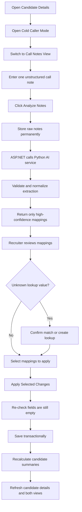

# Cold Caller Mode — Call Notes View Design Proposal

## 1. Purpose

This document proposes the design for a second internal view inside **Cold Caller Mode**.

The existing view remains unchanged and becomes:

- **Fields View** — section-based, field-by-field data collection.

The new view becomes:

- **Call Notes View** — unstructured call notes converted by AI into high-confidence structured candidate data, reviewed by the recruiter, and applied only to currently empty fields.

The goal is to let recruiters capture a full phone conversation naturally without switching between many individual inputs during the call.

---

## 2. Final Product Rules

1. Use one Cold Caller dialog with two internal views.
2. Support one final note submission per cold-call session.
3. Store raw submitted notes permanently for audit/history.
4. Update only fields that are empty at apply time.
5. Return only high-confidence mappings from the backend.
6. Never allow the LLM to write directly to the database.
7. Require recruiter review before applying changes.
8. Create new lookup values only after explicit recruiter confirmation.
9. Use a separate Python AI extraction service.
10. Refresh candidate details, Data Progress, and derived summaries after apply.

---

## 3. View Switcher

Add a segmented switcher in the Cold Caller header:

```text
[ Fields View ] [ Call Notes View ]
```

Recommended type:

```ts
type ColdCallerViewMode = "fields" | "callNotes"
```

Switching views must not clear generated questions, notes, answers, mappings, verification state, or progress. Both views must share the same candidate and empty-field state.

---

## 4. End-to-End User Flow



---

## 5. Recommended UX Layout

### 5.1 Draft stage

```text
┌──────────────────────────────────────────────────────────────────────┐
│ Cold Caller Mode                 [Fields View] [Call Notes View]     │
│ Candidate Name • Phone Number                               [Close]   │
├──────────────────────┬───────────────────────────────────────────────┤
│ MISSING FIELDS       │ CALL NOTES                                    │
│                      │                                               │
│ Basic Information 3  │ Capture everything discussed during the call. │
│ Work Experience  11  │                                               │
│ Education         2  │ ┌───────────────────────────────────────────┐ │
│ Certifications    4  │ │ Current salary is 150000. In DPL his    │ │
│ Achievements      1  │ │ tech stacks were .NET and Azure...       │ │
│                      │ │                                           │ │
│ Current Salary       │ └───────────────────────────────────────────┘ │
│ LinkedIn URL         │ Draft saved locally                           │
│ Benefits             │                              [Analyze Notes]  │
└──────────────────────┴───────────────────────────────────────────────┘
```

Use a **large multiline notes editor**, not a ChatGPT-style conversation. The recruiter is capturing one consolidated call note, not chatting with the AI.

Recommended editor behavior:

- Minimum height around 320–420px.
- Auto-grow to a sensible maximum.
- Disable submission for empty or whitespace-only text.
- Optional `Ctrl/Cmd + Enter` shortcut.
- Regular Enter inserts a new line.
- Preserve the draft while the dialog remains open.
- Primary action label: **Analyze Notes**.

Suggested helper text:

```text
Enter everything discussed during the call in natural language. The system will identify high-confidence values for currently empty candidate fields.
```

### 5.2 Extracting stage

Keep submitted notes visible as read-only and show meaningful progress:

```text
Analyzing call notes…
Matching information to candidate work experiences…
Resolving known tech stacks, benefits, and other lookup values…
```

Do not replace the interface with a blank spinner. If extraction fails, allow retry using the same stored session and notes.

### 5.3 Review stage

Recommended desktop three-column layout:

```text
┌──────────────────┬──────────────────────────┬────────────────────────────┐
│ FIELD STATUS     │ SUBMITTED CALL NOTES     │ EXTRACTED DATA             │
│                  │                          │                            │
│ ✓ Current Salary │ Current salary is 150000 │ ☑ Current Salary           │
│ ✓ DPL Tech Stack │ In DPL his tech stacks   │   150,000                  │
│ ! Swipbox Benefit│ were .NET and Azure.     │   Source: “Current…”       │
│   LinkedIn URL   │ In Swipbox he received   │                            │
│                  │ paid and matrimonial     │ ☑ DPL — Tech Stacks        │
│                  │ leaves.                  │   .NET, Azure              │
│                  │                          │                            │
│                  │                          │ ☐ Swipbox — Benefits        │
│                  │                          │   Lookup confirmation needed│
├──────────────────┴──────────────────────────┴────────────────────────────┤
│ 3 selected                                  [Discard] [Apply Selected]  │
└─────────────────────────────────────────────────────────────────────────┘
```

For smaller screens, use steps:

```text
1. Submitted Notes
2. Review Extracted Data
3. Apply Changes
```

---

## 6. Left Fields Panel

Reuse the same section grouping as Fields View:

- Basic Information
- Work Experience
- Education
- Certifications
- Achievements
- Tech Stacks
- Independent Projects

Recommended statuses:

| Status | Meaning |
|---|---|
| Missing | No high-confidence value returned |
| Extracted | Mapping is ready for review |
| Lookup confirmation | A value needs matching or creation confirmation |
| Selected | Recruiter selected the mapping for apply |
| Applied | Successfully saved |
| Skipped | Recruiter rejected or skipped it |
| Stale | Field was filled elsewhere after extraction |

Statuses must use icons/text, not color alone.

---

## 7. Extracted Mapping Cards

Each card should show:

- Target section and field.
- Extracted value.
- Source sentence from the submitted notes.
- Matched work experience or lookup where relevant.
- Current mapping status.
- Select, edit, reject, and lookup-resolution actions.

### Scalar example

```text
☑ Current Salary
150,000

Source
“Current salary is 150000”

Status: Ready
[Edit]
```

### Nested work-experience example

```text
☑ Work Experience — DPL
Tech Stacks: .NET, Azure

Matched to
DPL • Software Engineer • Jan 2021–Apr 2023

Source
“In DPL his tech stacks were .NET and Azure”

[Change Match]
```

### Unknown lookup example

```text
☐ Work Experience — Swipbox
Benefit: Matrimonial Leaves

No matching benefit was found.

[Match Existing] [Create New] [Reject]
```

---

## 8. Lookup Creation Confirmation

Unknown values must never be created automatically.

Flow:

```text
Unknown value detected
→ Recruiter clicks Create New
→ Confirmation dialog opens
→ Recruiter confirms lookup type and normalized name
→ Lookup API creates the record
→ Returned ID is attached to the mapping
```

Example confirmation:

```text
Create New Benefit?

Name
Matrimonial Leaves

This will add a reusable benefit to the system.

[Cancel] [Create Benefit]
```

Disable **Apply Selected Changes** while any selected mapping has unresolved lookup values.

---

## 9. Session State

Recommended frontend stages:

```ts
type CallNotesStage =
  | "draft"
  | "submitting"
  | "extracting"
  | "review"
  | "applying"
  | "completed"
  | "extractionError"
  | "applyError"
```

Recommended state:

```ts
interface CallNotesViewState {
  stage: CallNotesStage
  rawNotesDraft: string
  sessionId?: number
  sessionStatus?: string
  mappings: ExtractedMapping[]
  selectedMappingIds: Set<number>
  unresolvedLookupCount: number
  extractionError?: string
  applyError?: string
}
```

After Analyze Notes, the submitted notes become immutable. A technical retry reuses the same session rather than creating a second submission.

---

## 10. Backend/API Design

### 10.1 Create session and analyze notes

```http
POST /api/candidates/{candidateId}/cold-call-sessions
```

Request:

```json
{
  "rawNotes": "Current salary is 150000. In DPL his tech stacks were .NET and Azure."
}
```

Recommended response:

```json
{
  "sessionId": 125,
  "candidateId": 42,
  "status": "extracting"
}
```

Prefer asynchronous extraction and return `202 Accepted`.

### 10.2 Poll session

```http
GET /api/candidates/{candidateId}/cold-call-sessions/{sessionId}
```

Possible statuses:

- `extracting`
- `readyForReview`
- `completed`
- `extractionFailed`
- `applyFailed`

Polling recommendation:

- Start at 1 second.
- Back off to 2–3 seconds.
- Stop at a terminal state.
- Stop when the dialog closes.
- Resume when reopening an active session.

### 10.3 Apply mappings

```http
POST /api/candidates/{candidateId}/cold-call-sessions/{sessionId}/apply
```

Request:

```json
{
  "mappings": [
    { "mappingId": 901, "action": "apply" },
    {
      "mappingId": 902,
      "action": "apply",
      "resolvedLookupIds": [14, 19]
    },
    { "mappingId": 903, "action": "reject" }
  ]
}
```

After success, refetch candidate details, verification data, empty-field state, and Data Progress.

---

## 11. Empty-Only Update Rules

The workflow must never overwrite an existing value.

Enforce this twice:

1. Before extraction, send only currently empty fields to the Python service.
2. Before apply, re-query the database and ensure every target field is still empty.

If a field was populated after extraction, mark the mapping as `stale` and do not apply it.

The UI must not expose a force-overwrite action.

---

## 12. Python AI Service Boundary

The Python service performs semantic extraction only.

It must not:

- access PostgreSQL directly;
- create lookup records;
- update candidate data;
- decide whether an existing field may be overwritten;
- mark values as verified.

ASP.NET should send:

- raw notes;
- only allowed empty fields;
- relevant candidate/work-experience context;
- schema/prompt version.

ASP.NET must validate the returned JSON, normalize values, match work experiences, resolve lookups, and filter out anything that does not meet deterministic validation.

---

## 13. High-Confidence Policy

The minimum confidence threshold should be backend configuration, for example:

```json
{
  "ColdCallerExtraction": {
    "MinimumConfidence": 0.85
  }
}
```

A mapping is returned only when all conditions pass:

- Confidence meets threshold.
- `fieldPath` is valid and allowed.
- Value type is compatible.
- Target field is currently empty.
- Enum/date/value is valid.
- Work-experience mapping is unambiguous.
- Lookup is resolved or explicitly flagged for recruiter confirmation.

Do not trust the LLM confidence value alone.

---

## 14. Work-Experience Mapping

For statements such as:

```text
In DPL his tech stacks were .NET and Azure.
In Swipbox he received paid leaves.
```

Preferred match order:

1. Exact existing `employer_id` derived from employer resolution.
2. Case-insensitive exact employer-name match.
3. Unique normalized employer-name match.
4. Otherwise exclude the mapping from the ready response.

Do not guess when multiple candidate work experiences could match.

---

## 15. Raw Notes Audit Design

Permanently store:

- candidate ID;
- recruiter/user ID;
- exact submitted notes;
- session status;
- submitted/extracted/applied timestamps;
- prompt version;
- schema version;
- model name/version;
- extraction and application outcomes.

Submitted notes should be immutable. Later corrections should be recorded as an amendment or a new session.

Recommended audit display:

```text
Cold Call Session #125
Submitted by Hassan
June 16, 2026 at 3:42 PM

[Read-only submitted notes]

5 fields extracted
4 applied
1 rejected
```

---

## 16. Verification

AI extraction does not automatically verify data.

Where verification integration exists, offer explicit actions:

```text
[Apply] [Apply & Verify]
```

Only internal users/admins may create verification records.

---

## 17. Derived Recalculation

After applying accepted mappings, invoke the broader candidate summary recalculation flow, including as applicable:

- Data Progress recalculation.
- Total Experience Months recalculation.
- Latest Job Title recalculation.

The frontend then refetches the candidate and refreshes both Cold Caller views.

---

## 18. Completed State

Do not close the dialog automatically.

Recommended result:

```text
✓ Call notes processed

4 candidate fields were updated.
1 lookup value was created.
Data Progress increased from 61% to 78%.

[View Updated Candidate] [Back to Fields View]
```

---

## 19. Error States

### Extraction failure

```text
We could not analyze these notes.

Your notes were saved and have not been lost.

[Retry Analysis] [Return to Notes]
```

### Apply failure

```text
Some changes could not be applied.

[Retry Apply] [Review Mappings]
```

### AI service unavailable

```text
The AI extraction service is temporarily unavailable.
Your submitted notes are safely stored.
```

---

## 20. Accessibility

- View switcher must be keyboard accessible.
- Textarea must have a visible label.
- Mapping selections must use accessible checkboxes.
- Status must not rely on color alone.
- Extraction progress should use `aria-live`.
- Move focus to the review heading when extraction completes.
- Confirmation dialogs must trap focus.
- All review/apply actions must be keyboard operable.

---

## 21. Component Proposal

```text
ColdCallerDialog
├── ColdCallerViewSwitcher
├── ColdCallerFieldsView
└── ColdCallerCallNotesView
    ├── ColdCallerFieldsSidebar
    ├── CallNotesEditor
    ├── ExtractionProgress
    ├── SubmittedNotesPanel
    ├── ExtractedMappingsPanel
    │   ├── ExtractedMappingCard
    │   └── LookupResolutionCard
    ├── LookupCreationConfirmationDialog
    └── ApplyMappingsFooter
```

Reuse the existing empty-field detection, section grouping, field paths, candidate refresh, verification badges, and Data Progress mechanisms. Do not duplicate business state between views.

---

## 22. Acceptance Criteria

### Views

- [ ] Cold Caller Mode contains Fields View and Call Notes View.
- [ ] Switching views preserves state.
- [ ] Applied updates appear in both views.

### Notes

- [ ] Recruiter can enter one notes block.
- [ ] Empty notes cannot be submitted.
- [ ] Submitted notes become read-only.
- [ ] Raw notes are permanently stored.

### Extraction

- [ ] ASP.NET calls the separate Python service.
- [ ] Only empty fields are considered.
- [ ] Only high-confidence mappings are returned.
- [ ] Ambiguous work-experience mappings are excluded.

### Review

- [ ] Each mapping shows target field, value, and source text.
- [ ] Recruiter can accept, edit, or reject mappings.
- [ ] New lookup values require explicit confirmation.
- [ ] No lookup record is created automatically.

### Apply

- [ ] Backend re-checks that fields are still empty.
- [ ] Stale mappings are not applied.
- [ ] Selected mappings save transactionally.
- [ ] Candidate details refresh after apply.
- [ ] Data Progress and derived summaries refresh.

### Audit

- [ ] Session stores recruiter, candidate, notes, timestamps, versions, and outcomes.
- [ ] Submitted raw notes remain immutable.
- [ ] Applied/rejected mapping outcomes are retained.

---

## 23. Final Recommendation

Implement the feature as:

```text
One Cold Caller dialog
    ├── Fields View
    └── Call Notes View
            ├── Missing-fields sidebar
            ├── Large unstructured notes editor
            ├── AI extraction through ASP.NET → Python
            ├── High-confidence mapping review
            ├── Explicit lookup confirmation
            └── Apply selected empty-field updates
```

This design provides fast recruiter data entry while preserving auditability, data integrity, reviewer control, and backend performance.
